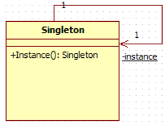
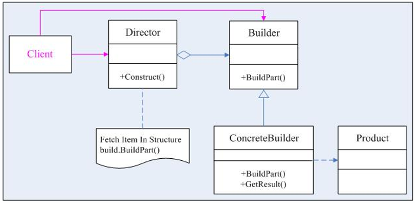
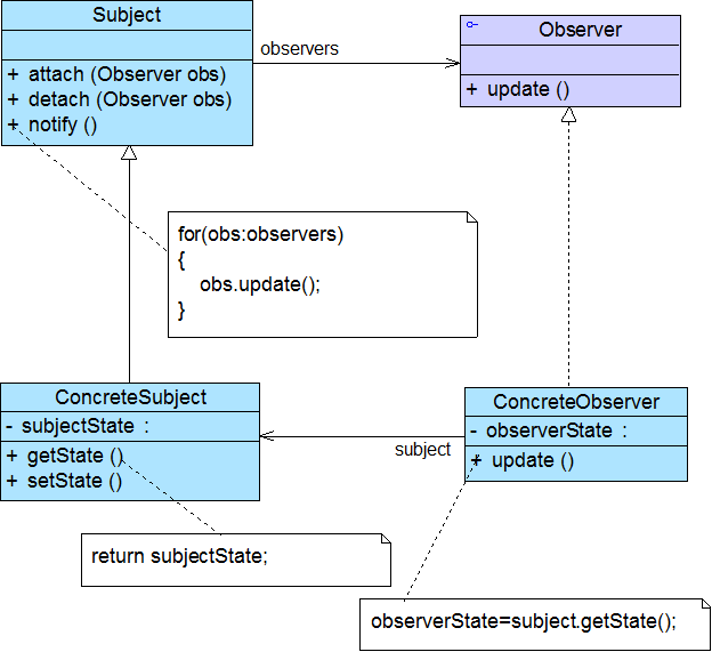
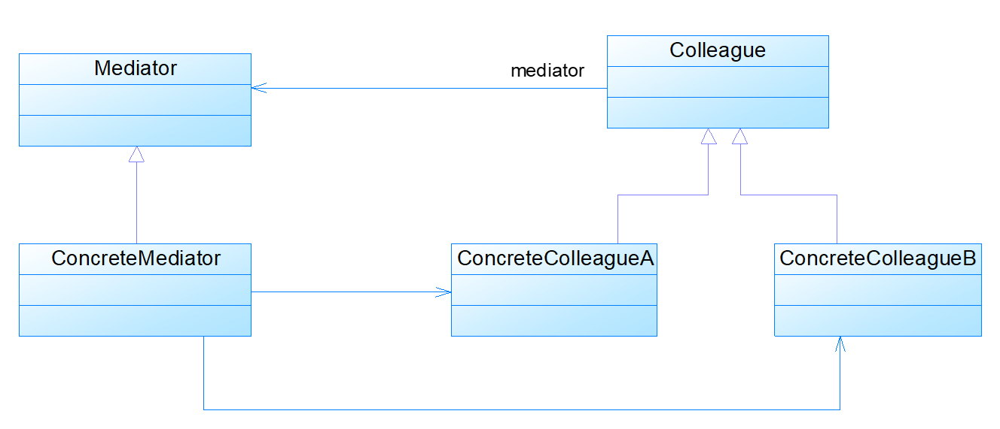
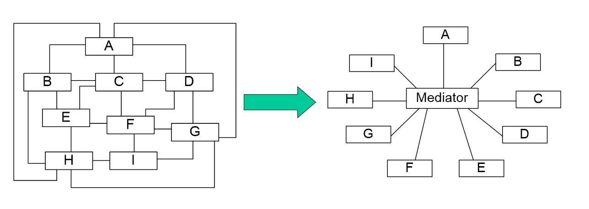
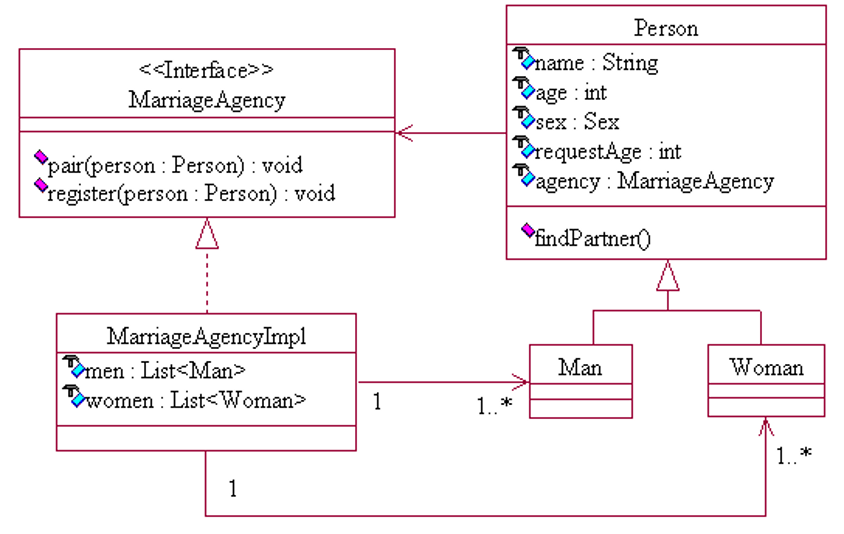

# 四种设计模式

### 1 单例模式

##### 1.1 特点

单例设计模式保证一个类只有一个实例，要提供一个访问该类对象实例的全局访问点

单例模式最重要的就是要保证一个类只有一个实例并且这个类易于被访问。

##### 1.2 单例模式的实现

- 为了避免其它程序过多的建立该类的对象，先禁止其它程序建立该类对象实例（将构造器私有化）。

- 为了方便其它程序访问该类的对象，只好在本类中自定义一个对象，由1可知该对象是static的，并对外提供访问方式。



单例模式的具体实现有两种：

（1）懒汉式

对象延迟加载，效率高，只有在使用的时候才实例化对象，若设计不当线程会不安全，代码相对于饿汉式复杂，第一次加载类对象的时候反应不快。

```cpp
class Singleton { 
      private static Singleton instance=null; 
      private Singleton(){} 

      public static Singleton getInstance() { 
              if(instance==null) {
                instance=new Singleton(); 
            }
            return instance; 
      } 
} 
```

（2）饿汉式

对象预先加载，线程是安全的，在类创建好的同时对象生成，调用获得对象实例的方法反应速度快，代码简练。

```cpp
 class Singleton {
       private static Singleton instance=new Singleton(); 
       private Singleton(){} 

       public static Singleton getInstance() { 
           return instance;
       }
 } 
```

### 2 建造者模式

将一个复杂对象的构建过程与其表示相分离，使得同样的构建过程可以创建不同的表示

##### 2.1 特点

（1）建造者模式的适用场景

- 需要生成的产品对象有复杂的内部结构

- 创建复杂对象的算法稳定，或建造者模式可以强迫生成一定的顺序

- 当构造过程允许被构造的对象有不同的表示时

（2）建造者模式的优点

- 客户端不必知道产品内部组成的细节，将产品本身与产品的创建过程解耦，使得相同的创建过程可以创建不同的产品对象

- 每一个具体建造者都相对独立，与其他的具体建造者无关，因此可以很方便地替换具体建造者或增加新的具体建造者，扩展方便，符合开闭原则

- 可以更加精细地控制产品的创建过程

（3）建造者模式的缺点

- 建造者模式所创建的产品一般具有较多的共同点，其组成部分相似，如果产品之间的差异性很大，不适合使用建造者模式，因此其使用范围受到一定的限制

- 如果产品的内部变化复杂，可能会需要定义很多具体建造者类来实现这种变化，导致系统变得很庞大，增加了系统的理解难度和运行成本

##### 2.2 建造者模式的结构和参与者



（1）Builder

     为创建一个Product对象的各个部件指定抽象接口。

（2）ConcreteBuilder

     实现Builder的接口以构造和装配该产品的各个部件。

     定义并明确它所创建的表示。

     提供一个检索产品的接口

（3）Director

     构造一个使用Builder接口的对象。定义了构造产品的每个步骤，指明如何借助Builder生产产品的过程。

（4）Product

     表示被构造的复杂对象，包含定义组成部件的类。ConcreteBuilder创建该产品的内部表示并定义它的装配过程。

##### 2.3 应用

模拟组装一台电脑

假设电脑由主板、CPU和内存三个部件构成

（1）定义产品角色

```cpp
public class Computer
{
    //电脑中零件的集合
    List<string> parts = new List<string>();
    //添加零件
    public void add(string part)
    {parts.Add(part);}
    //展示组装完成的电脑
    public void Show()
    { 
        Console.WriteLine(”\n 这是一台电脑，它包括：”) ；
        foreach(string part in parts)
        {Console.Write(part);}
    }
  } 
}
```

（2）定义抽象的Builder

```cpp
public abstract class Builder
{
    //添加主板
    public abstract void addMainBoard();
    //添加CPU
    public abstract void addCPU();
    //添加内存
    public abstract void addMemory();
    //获取组装好的产品
    public abstract Computer GetComputer(); 
}
```

（3）具体建造者，建造一台高性能计算机

```cpp
public class HighPerformanceComputer : Builder
{
    private Computer HPcomputer = new Computer();
    public override void AddMainBoard()//具体装主板的方法
    {HPComputer.add(“高档主板”);} 
    public override void AddCPU()//具体装CPU的方法
    {HPComputer.add(“双核 4.0GHz”);}
    public override void AddMemory() //具体装内存的方法
    {HPComputer.add(“4GB内存”);}
    public override void GetComputer() //具体获得产品的方法
    {return HPComputer;}
}
```

（4）具体建造者，建造一台普通性能计算机

```cpp
public class OrdinaryComputer : Builder
{
    private Computer Ocomputer = new Computer();
    public override void AddMainBoard()//具体装主板的方法
    {OComputer.add(“中档主板”);} 
    public override void AddCPU() //具体装CPU的方法
    {OComputer.add(“P4 2.0GHz”);}
    public override void AddMemory() //具体装内存的方法
    {OComputer.add(“512MB内存”);}
    public override void GetComputer() //具体获得产品的方法
    {return OComputer;}
}
```

（5）定义指挥者类

```cpp
public class Director
{
    public abstract void Construct(Builder builder) 
    {
         builder.AddMainBoard();
         builder.AddCPU();
         builder.AddMemory();
    }
}
```

（6）客户端代码

```cpp
static void Main(string[] args)
{
    //创建一个指挥者，用来指挥组装计算机   
    Director director = new Director();
    //高性能计算机的Builder
    Builder b1 = new HighPerformanceComputer();
    //创建一台高性能计算机   
    director.Construct(b1);
    //获取一台高性能计算机
    Computer HighPerformanceComputer = b1.GetComputer();
    //展示一台高性能计算机
    HighPerformanceComputer.Show();
}
```

### 3 观察者模式

建立一种对象与对象之间的依赖关系，一个对象发生改变时将自动通知其他对象，其他对象将相应做出反应。在此，发生改变的对象称为观察目标，而被通知的对象称为观察者，一个观察目标可以对应多个观察者，而且这些观察者之间没有相互联系，可以根据需要增加和删除观察者，使得系统更易于扩展，这就是观察者模式的模式动机。

### 3.1 定义

定义对象间的一种一对多依赖关系，使得每当一个对象状态发生改变时，其相关依赖对象皆得到通知并被自动更新。观察者模式又叫做发布-订阅（Publish/Subscribe）模式、模型-视图（Model/View）模式、源-监听器（Source/Listener）模式或从属者（Dependents）模式。

##### 3.2 观察者模式结构和分析

（1）观察者模式包含如下角色

- Subject: 抽象目标

- ConcreteSubject: 具体目标

- Observer: 观察者接口

- ConcreteObserver: 具体观察者

（2）观察者模式分析

- 观察者模式描述了如何建立对象与对象之间的依赖关系，如何构造满足这种需求的系统。

- 这一模式中的关键对象是观察目标和观察者，一个目标可以有任意数目的与之相依赖的观察者，一旦目标的状态发生改变，所有的观察者都将得到通知。

- 作为对这个通知的响应，每个观察者都将即时更新自己的状态，以与目标状态同步，这种交互也称为发布-订阅(publish-subscribe)。目标是通知的发布者，它发出通知时并不需要知道谁是它的观察者，可以有任意数目的观察者订阅它并接收通知。

### 3.3 特点

（1）观察者模式的优点

- 具体目标和具体观察者是松耦合关系。由于目标接口仅仅依赖于观察者接口，因此具体目标只是知道它的观察者是实现观察者接口的某个类的实例，但不需要知道具体是哪个类。同样，由于观察者仅仅依赖于目标接口，因此具体观察者只是知道它依赖的目标是实现目标接口的某个类的实例，但不需要知道具体是哪个类。

- 观察模式满足“开-闭原则”。目标接口仅仅依赖于观察者接口，这样，我们就可以让创建具体目标的类也仅仅是依赖于观察者接口，因此如果增加新的实现观察者接口的类，不必修改创建具体目标的类的代码。同样，创建具体观察者的类仅仅依赖于目标接口，如果增加新的实现目标接口的类，也不必修改创建具体观察者类的代码。

（2）观察者模式的缺点

- 如果一个观察目标对象有很多直接和间接的观察者的话，将所有的观察者都通知到会花费很多时间。

- 如果在观察者和观察目标之间有循环依赖的话，观察目标会触发它们之间进行循环调用，可能导致系统崩溃。

- 观察者模式没有相应的机制让观察者知道所观察的目标对象是怎么发生变化的，而仅仅只是知道观察目标发生了变化。

### 3.4 应用举例



有一个大学毕业生和一个归国留学者都希望能及时知道求职中心最新的职业需求信息。

（1）目标：Subject.java

```java
public interface Subject{
    public void addObserver(Observer o);
    public void deleteObserver(Observer o);
    public void notifyObservers( );
}
```

（2）观察者：Observer.java

```java
public interface Observer {
    public void hearTelephone(String heardMess);
} 
hearTelephone( )用来更新数据
```

（3）具体目标SeekJobCenter.java

```java
import java.util.ArrayList;                      
public class SeekJobCenter implements Subject {
    String mess;
    boolean changed;
    ArrayList<Observer> personList; 
    SeekJobCenter( ){
        personList=new ArrayList<Observer>( );
        mess=""; 
        changed=false; 
    }
    public void addObserver(Observer o){
        if( ! ( personList.contains(o) ) )
            personList.add(o); 
    }
    public void deleteObserver(Observer o){
        if(personList.contains(o))
            personList.remove(o); 
    }
    public void notifyObservers(){ 
        if(changed){
            for(int i=0;i<personList.size();i++) {
                Observer observer=personList.get(i);
                observer.hearTelephone(mess); 
            }
            changed=false; 
        }
    }
    public void giveNewMess(String str){
        if(str.equals(mess))
            changed=false;
        else{ 
            mess=str;
            changed=true;
        }      
    }
}
```

（4）具体观察者1：UniversityStudent.java

```java
import java.io.*;
public class UniverStudent implements Observer{
    Subject subject;
    File myFile;  
    UniverStudent(Subject subject,String fileName){
        this.subject=subject;
        subject.addObserver(this);  //使当前实例成为subject所引用的具体主题的观察者
        myFile=new File(fileName);
    }
    public void hearTelephone(String heardMess){
        try{ RandomAccessFile out=new RandomAccessFile(myFile,"rw");  
            out.seek(out.length());
            byte [] b=heardMess.getBytes();
            out.write(b);                               //更新文件中的内容
            System.out.print("我是一个大学生,"); 
            System.out.println("我向文件"+myFile.getName()+"写入如下内容:");
            System.out.println(heardMess); 
        }
        catch(IOException exp){
            System.out.println(exp.toString());
        }
    } 
}
```

具体观察者2： HaiGui.java

```java
import java.io.*;
import java.util.regex.*;
public class HaiGui implements Observer{
    Subject subject;
    File myFile;  
    HaiGui(Subject subject,String fileName){
        this.subject=subject;
        subject.addObserver(this);     //使当前实例成为subject所引用的具体主题的观察者
        myFile=new File(fileName);
    }
    public void hearTelephone(String heardMess){
        try{ boolean boo=heardMess.contains("java程序员")||heardMess.contains("软件");
            if(boo){ 
                RandomAccessFile out=new RandomAccessFile(myFile,"rw");  
                out.seek(out.length());
                byte [] b=heardMess.getBytes();
                out.write(b); 
                System.out.print("我是一个海归,"); 
                System.out.println("我向文件"+myFile.getName()+"写入如下内容:");
                System.out.println(heardMess);
            }
            else{
                System.out.println("我是海归,这次的信息中没有我需要的信息");
            } 
        }
        catch(IOException exp){
            System.out.println(exp.toString());
        }
    } 
} 
```

（5）应用：Application.java

```java
public class Application{
    public static void main(String args[]){
        SeekJobCenter center=new SeekJobCenter();           
        UniverStudent zhangLin=
                    new UniverStudent(center,"A.txt");
        HaiGui wangHao=new HaiGui(center,"B.txt");          
        center.giveNewMess("腾辉公司需要10个java程序员。");   
        center.notifyObservers();                              
        center.giveNewMess("海景公司需要8个动画设计师。");
        center.notifyObservers();
        center.giveNewMess("仁海公司需要9个电工。");
        center.notifyObservers();
    }
}
```

### 4 中介者模式

### 4.1 动机和定义

（1）动机：对于一个模块，可能由很多对象构成，而且这些对象之间可能存在相互的引用，为了减少对象两两之间复杂的引用关系，使之成为一个松耦合的系统，我们需要使用中介者模式，这就是中介者模式的模式动机。

（2）定义：用一个中介对象来封装一系列的对象交互，中介者使各对象不需要显式地相互引用，从而使其耦合松散，而且可以独立地改变它们之间的交互。



### 4.2 中介者模式

（1）中介者模式包含如下角色

- Mediator: 抽象中介者

- ConcreteMediator: 具体中介者

- Colleague: 抽象同事类

- ConcreteColleague: 具体同事类

（2）中介者模式可以使对象之间的关系数量急剧减少



##### 4.3 特点

（1）中介者模式的优点

- 简化了对象之间的交互

- 将各同事解耦

- 减少子类生成

- 可以简化各同事类的设计和实现

（2）中介者模式的缺点

- 在具体中介者类中包含了同事之间的交互细节，可能会导致具体中介者类非常复杂，使得系统难以维护。

##### 4.4 中介者模式应用



（1）抽象中介者：MarriageAgency.java

```java
public interface MarriageAgency {
    void pair(Person person); // 为person配对
    void register(Person person); // 注册会员
}
```

（2）抽象同事类: Person.java

```java
public abstract class Person {
    String name; // 姓名
    int age; // 年龄
    Sex sex; // 性别
    int requestAge; // 要求对象的年龄。对对象只有这一个要求
    MarriageAgency agency; // 婚姻中介
    public Person(String name, int age, Sex sex, int requestAge, MarriageAgency agency) {
        this.name = name;
        ... ...
        agency.register(this); // 注册会员
    }
    // 寻找对象
    public void findPartner() {
        agency.pair(this);
    }
}
enum Sex {MALE, FEMALE;} 
```

（3）具体中介者 : MarriageAgencyImpl.java

```java
public class MarriageAgencyImpl implements MarriageAgency {
    List<Man> men = new ArrayList<Man>(); // 男会员
    List<Woman> women = new ArrayList<Woman>(); // 女会员
    public void register(Person person) {
        if (person.sex == Sex.MALE)
            men.add((Man) person);
        else if (person.sex == Sex.FEMALE)
            women.add((Woman) person);
    }
    public void pair(Person person) {
        if (person.sex == Sex.MALE) {
            for (Woman w : women)
                if (w.age == person.requestAge) {
                    System.out.println(person.name + "和" + w.name + "配对成功");
                    return;
                }
        } else if (person.sex == Sex.FEMALE) {
            for (Man m : men)
                if (m.age == person.requestAge) {
                    System.out.println(person.name + "和" + m.name + "配对成功");
                    return;
                }
        }
        System.out.println("没有为" + person.name + "找到合适的对象");
    }
}
```

（4）具体同事类1：Man.java

```java
public class Man extends Person {
    public Man(String name, int age, int requestAge, MarriageAgency agency) {
        super(name, age, Sex.MALE, requestAge, agency);
    }
}
```

（5）具体同事类2：Woman.java

```java
public class Woman extends Person {
    public Woman(String name, int age, int requestAge, MarriageAgency agency) {
        super(name, age, Sex.FAMALE, requestAge, agency);
    }
}
```

（6）测试类：Test.java

```java
public class Test {
    public static void main(String[] args) {
        MarriageAgency agency = new MarriageAgencyImpl();
        Person m1 = new Man("John", 20, 18, agency);
        Person m2 = new Man("Mike", 27, 25, agency);
        Person w1 = new Woman("Mary", 25, 27, agency);
        Person w2 = new Woman("Jane", 20, 22, agency);
        m1.findPartner();
        m2.findPartner();
    }
}
```
