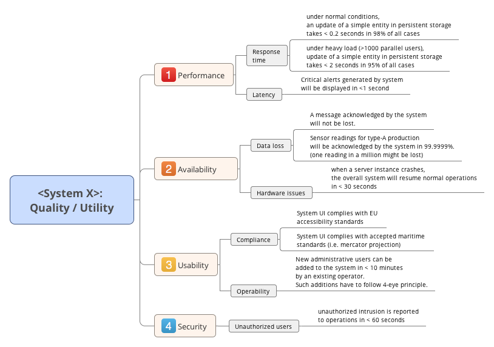

# 书名：Software Architecture in Practice

架构(Architecture)一词源自建筑领域，尽管看起来与软件设计毫无关联，但人们从上世纪60年代起就注意到两者的相似性[PHJ06]，并从结构和工程等方面大量借鉴了这个古老的学科，软件设计也因此获益匪浅[GHJV95]。当然不仅是软件，这个词也被其它领域广泛借鉴，例如作为计算机基础的体系结构(Computer architecture)，后者主要指计算机的物理结构或者CPU指令集。又比如企业架构(Enterprise architecture)、解决方案架构(Solution architecture)或者信息架构(Information architecture)等，则是表示针对各自问题域的专业性实践集合。

虽然架构与设计同属于本系列的主题之一，但迄今为止我们都很少提及。一方面是因为，作为诞生于上世纪90年代的buzz word，软件架构是在软件设计的基础上发展而来的，前者继承了后者的许多核心思想，例如模块化、原则、模式等，逐渐形成了更加庞大的体系。另一方面，架构一词如今具有极其丰富的含义，以至于可能达到阻碍交流的地步，因此确有必要首先对部分概念予以澄清。此外，除非特别说明，本系列文章中的架构均指软件架构。

### 1 定义和解释

架构是指一个系统在其所在环境中的基本概念和属性，这体现为系统的元素、关系及其设计和演进的原则。虽然这是ISO/IEC 42010对架构的正式定义，另一种USP(Unique selling proposition)定义则更详细地解释了这一点:

架构是一系列重要的决策，涉及描述软件系统的组织、确定结构化元素及其接口、确定元素在协作中的特定行为、指导结构和行为元素通过组合逐渐形成较大子系统的风格(涉及元素、接口、协作和组织等)。此外还要考虑用途、功能、性能、适应力、可重用性、可理解性、经济性、技术限制及其权衡、美学等因素。

以上定义明确指出了架构的表示(Representation)、质量属性(Quality attribute)以及风格(Style)等核心内容。此外，针对已有的架构方案，有时需要进行专门的架构评估(Architecture evaluation)，从而提前发现问题并控制潜在风险。本文剩余部分将作进一步讨论。

### 2 架构表示

由于架构本身的丰富性，采用适当方法描述架构就变得非常重要，一种基本的架构描述工具是架构视图(Architecture view)，其被用于表示架构在解决特定问题时所体现的结构化信息。由于完整的架构一般会涉及众多干系人，在单一视图中无法清楚表示所有信息，因此为了进一步在视图中区分来自不同干系人的诉求，采用架构视点(Architecture viewpoint)聚焦于某一类架构决策，并采用特定的标记和建模技术建立对应的架构视图。常见的架构视点有功能、逻辑、数据、模块、组件-连接器、需求、实现、并发、性能、安全、部署、用户使用及反馈等，由此可见其对应的架构视图也就非常丰富。

以组件-连接器类型的架构视图为例，该架构视图定义了系统中的可计算组件及其交互方式，其中组件是指可独立运行、且支持交互或存储数据的软件单元，连接器则被用于描述组件之间的交互机制。在构建组件-连接器视图的过程中，组件可以根据承担功能、可重用性、硬件单元，甚至团队的技术背景、康威定律以及产品演化路径等方式定义。同时，组件还需要描述其对外提供交互的接口(API)，包括访问端口、参数以及参数类型。然后根据组件间交互的需求，如同步、异步、延迟、吞吐量等确定连接器的类型和通信协议。连接器两端的组件分别被称为调用者和被调用者，组件与连接器之间通常需要相关配置以确定关联信息。

#### 2.1 架构描述语言

通常，架构视图是采用架构描述语言(Architecture description languages，ADL)具体实现的，如AADL、Wright、ACME、xADL等专门面向软件架构的语言。同时也可以采用通用的建模语言，例如UML，实际上后者在工业界更加流行。架构视图和ADL共同组成了架构表示的基本方法，但仍不足以有效应对架构的复杂性。这是因为在真实场景中架构视点可能是非常多的，架构需要从核心视点出发逐步完善，因此需要进一步参考适当的架构框架(Architecture framework)。

#### 2.2 架构框架

架构框架是指在特定应用领域或干系人社区中，创建、解释、分析和使用架构表示的通用实践集合。一种经典的架构框架是“4+1架构视图模型”[PK95]，其基本思想是需要采用若干个相互平行、且具有不同架构视点的架构视图，具体来说就是逻辑视图、进程视图、开发视图和物理视图等四种主要架构视图，以及相应的用例和场景说明，从而达到表示完整架构的目的。

- 逻辑视图，即把系统按照功能、通信、行为等进行结构化分解的结果，描述系统的静态信息。具体可以采用UML中的类图或状态图实现。
- 进程视图，即对系统中进程和线程的通信、执行过程进行描述，即系统的动态运行信息。具体可以采用UML中的部署图和活动图实现。
- 开发视图，也称作实现视图，用于描述软件开发过程中的软件结构，例如组件、包、类、子系统、代码库、文件等。具体可采用UML的组件图或包图实现。
- 物理视图，描述系统运行的硬件资源结构，及其与系统进程之间的映射关系。具体可采用UML中的部署图、时序图或协作图实现。
- 用例和场景，也称作用例视图，即从少量核心用例出发，描述系统中对象间、进程间的交互顺序。该视图主要用于构建可验证的架构原型，从而对当前架构进行测试。

根据上述5种架构视图，4+1架构视图模型能够建立一个核心的软件架构表示。然而从架构对整个软件工程的影响角度来说，架构框架作为架构表示的核心，往往还需要更多架构视点的支持，这与具体上下文密切相关，特别是接下来要讨论的质量属性。

### 3 质量属性

除了满足功能需求，架构还需要考虑系统的非功能需求(二者相互正交)，后者也被称作系统的质量属性，例如性能、可靠性、资源利用率、可用性、精确性等。与功能需求最显著的不同在于，质量属性往往是相对概念，一般表现为某种程度，且具备多种领域背景。正因为如此，质量属性大大提升了架构的复杂性，也是除了功能需求变化外另一个可能引起架构变化的重要原因。

ISO/IEC 25010对软件质量进行了明确定义，其中功能性表示系统功能的完整性、正确性、适当性与合规性，此外还包含7种非功能属性以及对应的子属性:

- 可靠性，指系统在特定时间和条件下维持当前性能的能力，包括成熟度、容错性、可恢复下、可用性等指标。
- 易用性，指个体或群体在使用系统时的难易程度。包括易理解性、易学习性、易操作性、界面美观性、操作错误保护以及可访问性。
- 高效性，指系统在特定条件下，资源使用量与软件性能之间的关系。包括耗时、资源利用率、容量等指标。
- 兼容性，指系统在特定的软、硬件环境中能够正常运行的能力。包括共存性、互操作性等指标。
- 安全性，指系统保护数据和执行正当行为的能力。包括保密性、完整性、非拒绝性、可审计性以及可验证性。
- 可维护性，指系统在需要做出特定修改时所花费的成本大小。包括可分析性、可改变性、稳定性、可测试性、模块性、可重用性以及可修改性。
- 可移植性，指系统迁移到其它环境的能力。包括可适应性、可安装性、可替换性等。

值得一提的是，经验研究表明并非所有的非功能需求都有同等机会引发架构变化[JAD16]，尽管它们可能拥有相同的重要性。但在进行架构相关决策时，依然不可避免地要考虑功能以及多种质量属性，这就导致从零开始设计架构具有极高的成本和风险。因此绝大多数架构设计活动实际上是遵循着经受实践检验的经验，即下面要讨论的架构风格。

### 4 架构风格

架构风格是指一系列满足功能和特定质量属性的设计决策与约束子集[RNE09]，其意义在于:

提供可重用的领域和工程知识，特别是相同领域或产品族中与应用无关的设计规则和决策，避免重新发明轮子。

阻止架构腐化和偏离，帮助未来开发人员在不损害基本架构原则的基础上扩展系统。

根据质量需求指导设计。

以经典的管道-过滤器架构为例，在该架构风格中，所有的过滤器都通过两个字节流“输入”和“输出”进行通信，这样就保证了任何过滤器都能够互相连接——即满足兼容性。另外，过滤器之间可以一次只传递部分数据，这样就能够尽可能提高过滤器之间并行计算的能力，从而提高系统效率。除此之外，应用中常见的架构风格还包括但不限于:

- 客户端-服务器(C/S)架构。
- 分层(三层或N层)架构。
- 点对点(Peer-to-peer)架构。
- 事件驱动(Event-driven)架构，也称隐式调用架构。
- 表述性状态转移(REST)架构。
- 面向服务架构(SOA)。
- 领域驱动设计(DDD)。

限于篇幅本文无法详细讨论每种架构风格。而事实上，在实际软件开发过程中架构风格往往是在最初就确定的，因此可被视为架构设计的设计规则。另外，大部分情况下整个系统会拥有多种架构风格，从而满足各种质量属性需求。

### 5 架构评估

由于架构的重要性，团队通常需要对已有的架构方案进行评估。架构权衡分析(Architecture tradeoff analysis method)是一种架构评估方法，采用该方法首先需要建立一个专门的架构评审小组，该小组应至少包含所有的干系人。启动评估后，首先应确保所有参与者熟悉评估流程以及业务背景。向所有评估者展示更高层次的系统架构，包括所采用的架构风格。然后通过质量属性树描述系统所要特别关注的质量属性，并且为每个所要满足的属性提供一个具体场景。一个质量属性树的例子如下图所示:

把所有场景按照优先级进行排序，然后逐一分析当前架构对该场景的适用性，根据相关反馈进行调整。最后在更大范围的干系人组织中分享当前架构知识。

### 6 结论
软件架构包含三个核心问题，分别是架构表示、质量属性和架构风格。架构表示是架构得以沟通并完善的重要途径，在架构设计的过程中不仅要考虑功能需求，还要考虑非功能需求(质量属性)，不同的架构风格在应对特定质量属性方面具有优势，因此真实场景中需要组合架构风格以满足来自不同干系人的需求。

#### 6.1 架构之美
人们在生活和工作中发现美并创造美，软件开发和架构设计也不例外。

架构之美体现了关注点的分离与结合。在软件设计中，设计师需要考虑多方面的关注点。漂亮的架构设计让这些关注点尽可能分离，然后以最简单的机制结合在一起，从而得到高内聚、低耦合的系统。例如在Darkstar项目中，架构师们考虑的重点就是如何将多人在线游戏的游戏逻辑与系统的可伸缩性分离开来，让游戏的开发者只要遵守少量的规则，就能够像编写单机游戏一样编写大规模多人在线游戏。又如REST架构风格，体现了对资源命名、请求处理和资源物理表现形式的关注点分离。资源的名称与请求资源时服务器的处理方式无关，请求者无需知道服务器端采取的技术，并且请求者本来就不关心服务器端的处理技术。资源的物理表示形式可以通过内容协商来决定，使系统可以支持多种物理表示形式，并可以方便地扩展。

架构之美注重表达的简洁性。“Don’t Repeat Yourself”，好的架构致力于消除各种类型的信息重复。从结构化程序设计中的子程序和函数，到面向对象程序设计中的继承，无不体现了对表达简洁性的特殊偏爱。在敏捷方法学中，消除重复则是重构的主要目的之一。爱因斯坦说：“让它尽可能简单，但不要过于简单。”我们需要考虑所有必须考虑的关注点，然后用简洁漂亮的架构体现我们的关注。同时，简洁的架构之美也降低了软件的总体成本，从这个意义上说，“简洁性”又可以称为“经济性”。

架构之美需要解决实际问题，它既是艺术，也是生活。软件像建筑一样，它的美不能脱离它的实用价值。Bjarne Stroustrup说，人类文明运行于软件之上。每一个软件都有自己的架构，这些架构有的很美，有的不太美。从艺术的角度来说，美是创造矛盾并解决矛盾。架构的多关注点和表达简洁性就是一种矛盾，美丽的架构提供了这一矛盾的解决 方法，让我们的内心产生一种愉快的感觉。

架构之美需要经过专业的学习才能更好地欣赏和创造。和所有的艺术之美一样，不是说不经过专业学习就不能欣赏，但是经过了专业的学习，就能更好地欣赏这种美的种种精妙之处。如果想要创造出这种美，那就必然要经过长期的专业学习。架构之美经过时间打磨。像Facebook面向数据的Web服务、FQL和FML架构，是在对应不同实际需求的过程中逐渐发展起来。在应用程序架构形成的过程中，设计者不断面对新的关注点需求，不断对已有的架构进行修改，并发展出新的架构组件。这就是所谓的“演进式架构”。只有变化是永恒不变的。在架构设计初期，设计者会将一些关注点有意推迟到将来考虑，例如持久和并发。对于这些暂不考虑的关注点，设计者对它们的实现方式尽可能不做任何假定，从而保留更多的可能性，让不同关注点之间的耦合尽可能小。架构之美没有定法。虽然有一些法则可供我们参考，却没有非如此不可的。《金刚经》云：“一切贤圣，皆以无为法而有差别。”

如果认为“架构”是一个简单的实体，能够用一份文档或一张图纸来描述，那就错了。架构师必须做出许多设计决定。要想有用，这些决定必须用文档记录下来，这样就能够进行复审、讨论、修改和批准，然后作为后续决定和构建时的约束。对于软件系统，这些设计决定包括行为上的和结构上的。

外部行为描述展示了产品如何与它的用户、其他系统和外部设备进行交互，这应该表现为需求。结构描述展示了产品如何划分为多个部分，以及这些部分之间的关系。我们还需要内部行为描述，用于描述组件之间的交互接口。结构上的描述常常展示相同部分的一些不同视图，因为不可能把所有信息以有意义的方式组织到一张图纸或一份文档中。

一个视图中的组件，可能是另一个视图中一个组件的一个部分。

软件架构常常表现为分层的层次结构，这种层次结构将几种不同的结构放在一张图中。20世纪70年代，Parnas指出“层次结构”这个术语已经被滥用，然后精确地定义了它，并给出了几个不同结构的例子，它们在设计不同系统时实现了不同的目的（Parnas 1974）。将架构的结构描述为一组视图（view），每个视图关注不同的部分，现在已成为了广泛接受的标准架构实践（Clements等2003; IEEE 2000）。我们将使用“架构”这个词来代指一组有标注的图纸和功能描述，它说明了设计和构建一个系统时所使用的结构。在软件开发社区中，针对这样的图纸和描述，人们使用并建议了许多不同的形式。在Hoffman和Weiss（2000，第14章和第16章）的著作中可以看到一些例子。

一个程序或计算系统的软件架构是系统的一种结构或一组结构，它包含软件元素、这些元素的外部可见的属性，以及元素之间的关系。“外部可见”的属性是其他元素对该元素可以做出的假定，诸如它提供的服务、执行时的特征、错误处理、共享资源的使用等。
