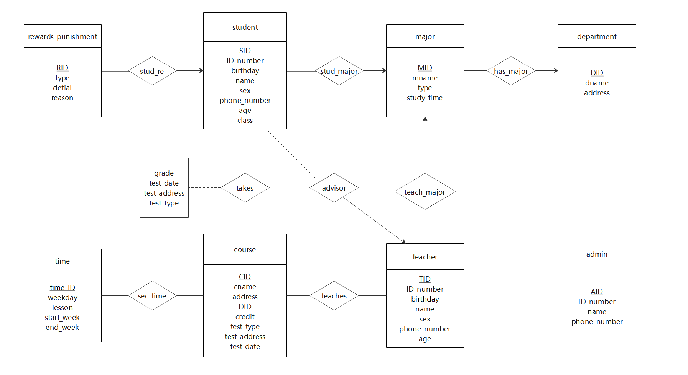
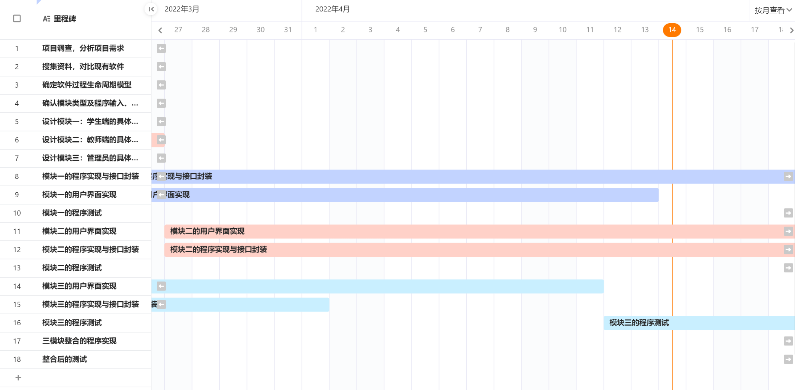

# 实验六 软件需求规格说明SRS（2）

### 实验目的

1. 学习最新软件需求规格说明SRS文档的要求和特点

2. 练习用各种静态建模工具 (E-R、UML等）对所负责的项目进行建模，与用户沟通。

3. 完善自己项目的SRS。

### 实验内容

#### 1. 阅读《掌握需求过程(第3版) 》，对比其附录A和国标SRS（上周已发）的模板，分析有什么不同和特点。选择其中必要的部分，补充进自己项目的SRS。

##### （1）Volere需求规格说明和国标SRS的不同点

1. 从总体架构上看，Volere需求规格说明包括项目驱动、项目规格说明、功能需求、非功能需求与项目问题五个大块，而国标SRS模板则分为引言、总体描述与具体需求三个方面。
2. 从细分的小项来看，Volere需求规格说明共分为27个小项，而国标SRS模板则包含19个小项。可见在项目的划分上，Volere更为细致与详尽，而国标STS模板则比较笼统。
3. 对二者的每个小项进行对比，可以得出以下不同：
   - Volere中“项目的目标”对应国标SRS中的“目的”，但前者包括内容、动机、考虑、形式四个方面，而后者只包括目的与预期读者两方面。
   - Volere中的“利益相关者”对应国标SRS中的“用户特点”，前者分别对顾客、用户、其他利益相关者、产品的直接操作用户、假想用户以及维护用户和服务技术人员进行了分析与职能划分，并对各种用户设定了优先级，描述了他们的参与程度，而后者只给出了预期用户的一半特征。
   - Volere中的“强制的限制条件”对应国标SRS中的“约束”，前者分析了解决方案的限制条件、当前系统的实现环境、伙伴应用或协作应用、立即可用的软件、预期的工作地点环境、进度计划限制条件、该产品的财务预算与企业限制条件这八个方面的限制条件，后者则包括了法规政策、硬件局限、与其他应用的接口、并行操作、审核功能、控制功能、高级语言需求、信号握手协议、可靠性要求、应用的关键性、安全和保密安全考虑11个方面。
   - Volere中“命名惯例和定义”对应国标SRS中的“定义、简写和缩略语”，前者着重强调了同义词的解释，后者则强调了缩略语的定义，其所要求的内容均为正确解释项目涉及的所有术语，主要内容是一致的。
   - Volere中的“相关事实和假定”对应国标SRS中的“假设和依赖关系”，前者包括了事实、业务规则与假定三个模块，后者则列出了影响SRS规定需求的每个因素。
   - 国标SRS中“引用文件”部分提供了SRS引用的所有文件的完整清单，并标明其编号、日期等基本信息以及来源，这一部分是Volere需求规格说明中没有涉及的内容。
   - 国标SRS中“综述”部分说明了SRS是如何组织的，这一部分也是Volere需求规格说明中没有涉及的内容。
   - Volere中“产品的范围”对应国标SRS中的“范围”，前者包括了产品边界、产品用例清单、单个产品用例三个部分，而后者主要包括产品的相关收益、目标、目的以及功能四个方面。
   - Volere中“工作的范围”包括当前的状况、工作的上下文范围、工作的切分、确定业务用例四个模块，这一部分是在国标SRS中没有涉及到的内容。
   - Volere中“业务数据模型和数据字典”包括数据模型与数据字典两个方面，这一部分是在国标SRS中没有涉及到的内容。
   - 国标SRS中的“产品描述”分为系统接口、用户界面、硬件接口、软件接口、通信接口、内存、运行、现场适应性需求八个方面，这一部分是Volere需求规格说明中没有涉及的内容。
   - 国标SRS中的“产品功能”给出了产品拥有的主要功能的概述，这一部分是Volere需求规格说明中没有涉及的内容。
   - 国标SRS中的“需求分配”用于识别可能推迟到系统将到来版本的需求，这一部分是Volere产品需求规格说明中没有涉及的内容。
   - 在对需求的具体描述上，Volere需求规格说明通过“功能需求”、“观感需求”（外观需求、风格需求）、“易用性和人性化需求”（易于使用的需求、个性化和国际化需求、学习的容易程度、可理解性和礼貌需求、可用性需求）、“执行需求”（速度和延迟需求、安全性至关重要的需求、精度需求、可靠性和可访问性需求、健壮性或容错需求、容量需求、可伸缩性和可扩展性需求、寿命需求）、“操作和环境需求”（预期的物理环境、与相邻系统接口的需求、产品化需求、发布需求）、“可维护性和支持需求”（可维护性需求、支持需求、适应能力需求）、“安全性需求”（访问控制需求、完整性需求、隐私需求、审计需求、免疫力需求）、“文化需求”、“法律需求”（合法需求、标准需求）九个小项目来进行描述，而国标SRS则通过外部接口、功能、性能需求、数据库逻辑需求、设计约束、软件系统属性（可靠性、可用性、安全保密性、可维护性、可移植性）、具体需求的组织（系统模式、用户类型、对象、特征、激励、响应、功能层次）、附加说明八个方面来进行描述。
   - Volere需求规格说明通过“开放式问题”、“立即可用的解决方案”（已经做好的产品、可复用组件、可复制的产品、）、“新问题”（对当前环境的影响、对已实施的系统的影响、潜在的用户问题、预期的实现环境会存在什么限制新产品的因素、后续问题）、“任务”（项目计划、开发阶段计划）、“迁移到新产品”（迁移到新产品的需求、为了新系统数据必须进行的修改和转换）、“风险”、“费用”、“用户文档培训”（用户文档需求、培训需求）、“后续版本需求”、“关于解决方案的设想”十个模块来总结分析了产品开发过程中可能出现的问题并给出一些响应的预案，同时分析了产品的风险与费用问题，这些内容都是国标SRS中没有涉及到的内容。
   - 国标SRS中的“支持信息”列出了SRS的目次、索引与附录，使得SRS更容易使用，方便读者阅读与理解，这一部分是Volere需求规格说明中没有涉及到的内容。

##### （2）Volere需求规格说明和国标SRS的特点

1. Volere需求规格说明的特点：
   - 条目的划分更为详细。
   - 对于产品需求的考虑方向更为广阔全面。
   - 对项目可能出现的问题进行了罗列，并分析了项目的风险与费用，这在项目的具体实施过程中有很大帮助。

2. 国标SRS的特点：
   - 包括了很多对产品的功能描述，有助于理解产品的需求
   - 在产品需求中加入了软件系统的属性需求，使得产品更加切合实际。
   - 目次、索引、附录齐全，使用起来比较方便，理解起来也比较简单。

#### 2. 参照课本及PPT上例子，练习用静态建模(E-R、UML）等工具对所负责的系统建模，用模型model与用户沟通。分析、归纳、总结出符合实际的需求规格。

##### E-R建模

#### 3. 分工协作，用上面的工作补充完善SRS和所负责的项目。

### 本周进度

##### 个人进度

- [x] 马一凌 用E-R工具对项目静态建模，用DFD数据流图对项目静态建模
- [ ] 何欣越 
- [ ] 陈淑媛 
- [ ] 邱情珍 
- [x] 曾祥薇 对比《掌握需求过程（第三版）》的附录A和国标SRS的模板，分析不同点和特点

##### 团队进度

- [x] 完善可行性分析报告
- [x] ch3习题11、12
- [x] 了解Scrum开发方法
- [x] 估算项目初始工作量
- [x] 风险分析

