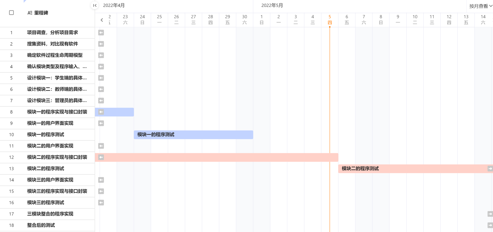

# 实验九 软件体系结构设计（一）
### 实验目的
1. 学习对比软件体系结构设计GB和IEEE最新SAD(Software Architecture Document)的标准
2. 研究经典软件体系结构案例
3. 给项目添加提高质量属性的设计 

### 实验内容
#### 1. 分工协作，参考国标“13 - 软件(结构)设计说明(SDD)”等资料，对比参考SAD最新标准IEEE-42010.pdf，针对自己的项目设计SAD初稿

#### 2. 分工协作，学习、检索研究经典软件体系结构案例
##### 常见风格分类

体系结构风格的形成是多年探索研究和工程实践的结果。一个良好和通用的体系结构风格往往是工程技术领域成熟的标志。经过多年的发展，已经总结出许多成熟的软件体系结构风格，例如：

- 数据流风格：批处理和管道/过滤器。
- 调用/返回风格：主程序/子程序、层次结构和C/S。
  面向对象风格。
- 独立部件风格：进程通信和事件驱动。
- 虚拟机风格：解释器和基于规则的系统。
- 数据共享风格：数据库系统和黑板系统。

##### 体系风格详述

**(1) 管道/过滤器 体系结构风格**

主要包括过滤器和管道两种元素。在这种结构中，构件被称为过滤器，负责对数据进行加工处理。每个过滤器都有一组输入端口和输出端口，从输入端口接收数据，经过内部加工处理之后，传送到输出端口上。数据通过相邻过滤器之间的连接件进行传输，连接件可以看作输入数据流和输出数据流之间的通路，这就是管道。

优点：

- 简单性。
- 支持复用。
- 系统具有可扩展性和可进化型。

- 系统并发性（每个过滤器可以独立运行，不同子任务可以并行执行，提高效率）。
   - 便于系统分析。

   缺点：
   
   - 系统处理工程是批处理方式。
   - 不适合用来设计交互式应用系统。
- 由于没有通用的数据传输标准，因此每个过滤器都需要解析输入数据和合成数据。
   - 难以进行错误处理。
   
   **传统的编译器就是管道/过滤器体系结构风格的一个实例。**编译器由词法分析、语法分析、语义分析、中间代码生成、中间代码优化和目标代码生成几个模块组成，一个模块的输出是另一个模块的输入。源程序经过各个模块的独立处理之后，最终将产生目标程序。编译器的框架结构如图：
   
   

**(2) 面向对象 体系结构风格**

在面向对象体系结构中，软件工程的模块化、信息隐藏、抽象和重用原则得到了充分的体现。在这种体系结构中，数据表示和相关原语操作都被封装在抽象数据类型中。在这种风格中，对象是构件，也成为抽象数据类型的实例。对象与对象之间，通过函数调用和过程调用来进行交互。

原理图：

   优点：

- 一个对象对外隐藏了自己的详细信息

- 对象将数据和操作封装在一起

- 继承和封装方法为对象服用提供了技术支持

缺点：

- 如果一个对象要调用另一个对象，则必须知道它的标识和名称

- 会产生连锁反应

**(3) 事件驱动 体系结构风格**

   事件驱动就是在当前系统的基础之上，根据事件声明和发展状况来驱动整个应用程序运行。

   事件驱动体系结构的基本思想是：系统对外部的行为表现可以通过它对事件的处理来实现。在这种体系结构中，构件不再直接调用过程，而是声明事件。系统其他构件的过程可以在这些事件中进行注册。当触发一个事件的时候，系统会自动调用这个事件中注册的所有过程。因此，触发一个事件会引起其他构件的过程调用。

   原理图：

   

   优点：

   1. 事件声明者不需要知道哪些构件会响应事
   2. 提高了软件复用能力
   3. 便于系统升级

   缺点：

   1. 构件放弃了对计算的控制权，完全由系统来决定
   2. 存在数据传输问题

**(4) 分层 体系结构风格**

   在分层风格中，系统将划分为一个层次结构。

   每一层都具有高度的内聚性，包含抽象程度一致的各种构件，支持信息隐藏。

   分层有助于将复杂系统划分为独立的模块，从而简化程序的设计和实现。

   通过分解，可以将系统功能划分为一些具有明确定义的层，较高层是面对特定问题，较低层具有一般性。

   每层都为上层提供服务，同时又利用了下层的逻辑功能。在分层体系结构中，每一层只对相邻层可见。层次之间的连接件是协议和过程调用。用以实现各层之间的交互。

​    

   原理图：

  优点：

- 设计者可以将系统分解为一个增量的步骤序列从而完成复杂的业务逻辑。
- 每一层之多和相邻的上下两层进行交互。
- 只要给相邻层提供相同的接口。

  缺点：

- 并非所有系统都能够按照层次来进行划分。
  很难找到一种合适和正确的层次划分方法。

- 在传输数据时，需要经过多个层次。

- 多层结构难以调试。

**(5) C2 体系结构风格**

C2结构是一个层次网络，包括构件和连接件两种软件元素。构件和连接键都是包含顶部和底部的软件元素。构件和构件之间只能通过连接件进行连接，而连接件之间则可以直接进行连接。构件的顶部、底部分别与连接件的底部、顶部连接，连接件的顶部、底部也分别与连接件的底部、顶部连接。

在C2体系结构中，构件之间的所有通信必须使用消息传递机制来实现。构件之间所有传递的信息可以分为两种，一种是向上层构件发出服务请求的请求消息，另一种是向下层构件发出指示状态变化的通知消息。连接件负责消息的过滤、路由、广播、通信和相关处理。

原理图：

优点：

- 可以使用任何编程语言来开发构件，构件重用和替换比较容易实现
  具有一定的扩展能力，可以有多种不同粒度的构件
- 构件不需要共享地址空间，避免了共享全局变量所造成的复杂关系
  具有良好的适应性
- 在C2体系结构中，可以使用多个工具集和多种媒体类型，能够动态地更新系统的框架结构

缺点

- 构件和构件之间不允许直接相连
- 与某一个连接件相关联的构件和连接件的数目没有限制

**(6) 数据共享 体系结构风格**

数据共享风格也成为仓库风格。

在这种风格中，有两种不同类型的软件元素：一种是中央数据单元，也成为资源库，用于表示系统的当前状态；另一种是相互依赖的构件组，这些构件可以对中央数据单元实施操作。中央数据单元和构件之间可以进行信息交换，这是数据共享体系结构的技术实现基础。

根据所使用的控制策略不同，数据共享体系结构可以分为两种类型，一种是传统的数据库，另一种是黑板。

如果由输入流中的事件来驱动系统进行信息处理，把执行结构存储到中央数据单元，则这个系统就是数据库应用系统。

如果由中央数据单元的当前状态来驱动系统运行，则这个系统就是黑板应用系统。

黑板是数据共享体系结构的一个特例，用以解决状态冲突并处理可能存在的不确定性知识源。

黑板常用于信号处理，如语音和模式识别，同时在自然语言处理领域中也有广泛的应用，如机器翻译和句法分析。

原理图：

一个典型的黑板系统主要包括知识源、中央控制单元、控制单元。

优点：

1. 便于多客户共享大量数据，而不必关心数据是何时产生的、由谁提供的及通过何种途径来提供
2. 便于将构件作为知识源添加到系统中来

缺点：

1. 对共享数据结构，不同知识源要达成一致
2. 需要同步机制和加锁机制来保证数据的完整性和一致性，增大了系统设计的复杂度

**(7) 解释器 体系结构风格**

解释器作为一种体系结构，主要用于构建虚拟机，用以弥合程序语义和计算机硬件之间的间隙。实际上，解释器是利用软件来创建的一种虚拟机，因此，解释器风格又被称为虚拟机风格。

原理图：

优点：

1. 能够提高应用程序的抑制能力和变成语言的跨平台移植能力。
2. 实际测试工作可能费城复杂，测试代价极其昂贵，具有一定的风险性。

缺点：

1. 由于使用了特定了语言和自定义操作规则，因此增加了系统运行的开销。
2. 解释器系统难以设计和测试。

**(8) 反馈控制环 体系结构风格**

定义：

反馈控制环是一种特定的数据流结构。传统数据流结构是线性的，而控制连续循环过程的体系结构应该是环形的。

反馈控制环系统主要包括以下三个部分：

过程，指操纵过程变量的相关机制。
数据元素，指连续更新的过程变量，包括输入变量、控制变量、操纵变量和相关参考值。
控制器，通过控制规则来修正变量，收集过程的实际状态和目标状态，调节变量以驱动实际状态朝目标状态前进。

原理图

1. 过程控制是连续的，可以利用各种构件和相关规则来设计反馈控制环系统，实现各种功能。
2. 反馈控制环结构能够处理复杂的自适应问题，机器学习就是一个例子。

**(9) C/S 体系结构风格**

优点：

客户机构件和服务器构件分别运行在不同的计算机上，有利于分布式数据的组织和处理。
构件之间的位置是相互透明的，客户机程序和服务器程序都不必考虑对方的实际存储位置。
客户机侧重数据的显示和分析，服务器则注重数据的管理。
构件之间是彼此独立和充分隔离的。
将大规模的业务逻辑分布到多个通过网络连接的低成本的计算机，降低了系统的整体开销。

缺点：

开发成本较高。
在开发C/S结构系统时，大部分工作都都集中在客户机程序的设计上，增加了设计的复杂度。
信息内容和形式单一。
如果对C/S体系结构的系统进行升级，开发人员需要到现场来更新客户机程序，同时需要对运行环境进行重新配置，增加了维护费用。
两层C/S结构采用了单一的服务器，同时以局域网为中心，因此难以扩展到Intranet和Internet。
数据安全性不高。

**(10) B/S 体系结构风格**

B/S结构是三层C/S体系结构的一种实现方式，主要包括浏览器，Web服务器和数据库服务器。B/S结构主要利用不断成熟的WWW技术，结合浏览器的多脚本语言，采用通用浏览器来实现原来需要复杂的专用软件才能实现的强大功能，节约了开发成本。

B/S体系结构的核心是Web服务器，可以将应用程序以网页的形式存放在Web服务器上。

当用户运行某个应用程序时，只需要在可以断的浏览器中输入响应的 URL，向 Web 服务器提出 HTTP 请求。

当Web 服务器接收 HTTP 请求之后，会调用相关的应用程序（Servlets），同时向数据库服务器发送数据操作请求。

数据库服务器对数据操作请求进行响应，将结果返回给Web服务器的应用程序。

Web服务器应用程序执行业务处理逻辑，利用 HTML 来封装操作结果，通过浏览器呈现给用户。在B/S结构中，数据请求、王爷生成、数据库访问和应用程序执行全部由Web 服务器来完成。

原理图：

优点：

客户端只需要安装浏览器，操作简单。
运用HTTP标准协议和统一客户端软件，能够实现跨平台通信。
开发成本比较低，只需要维护Web服务器程序和中心数据库。

缺点：

个性化程度比较低，所有客户端程序的功能都是一样的。
客户端数据处理能力比较差。
在B/S结构的系统中，数据提交一般以页面为单位，动态交互性不强，不利于在线事务处理。
B/S体系结构的可扩展性比较差，系统安全性难以保障。
B/S结构的应用系统查询中心数据库，其速度要远低于C/S体系结构。

**(11) 公共对象请求代理（CORBA）体系结构风格**

公共对象请求代理（Common Object Request Broker Architecture，CORBA）是由对象管理组织（Object Management Group，OMG）提出来的，是一套完整的对象技术规范，其核心包括标准语言、接口和协议。

在异构分布式环境下，可以利用CORBA来实现应用程序之间的交互操作，同时，CORBA也提供了独立于开发平台的编程语言的对象重用方法。

优点：

1. 实现了客户端程序与服务器程序的分析。
2. 将分布式计算模式与面向对象技术结合起来，提高了软件复用率。
3. 提供了软件总线机制，软件总线是指一组定义的完整的接口规范。
4. CORBA能够支持不同的编程语言和操作系统，在更大的范围内，开发人员能够相互利用已有的开发成果。

**(12) 正交 体系结构风格**

正交体系结构是一种以 垂直线索构件族 为基础的层次化结构，包括组织层和线索。

在每一个组织层中，都包含具有相同抽象级别的构件。

线索是子系统的实例，是由完成不同层次功能的构件通过相互调用而形成的，每一条线索完成系统的一部分相对独立的功能。

在正交体系结构中，每条线索的实现与其他线索的实现无关或关联很少。在同一层次中，构件之间不存在相互调用关系。

原理图：

优点：

1. 结构清晰。
2. 便于修改和维护。
3. 易于重用。

**(13) MVC 体系结构风格**

模型-视图-控制器（Model-View-Controller，MVC）是一种常见的体系结构风格。MVC被广泛应用与用户交互程序的设计中。

原理图：

优点：

1. 多个视图与一个模型相对应
2. 具有良好的移植性。
3. 系统被分割为三个独立的部分，当功能发生变化时，改变其中的一个部分就能够满足要求。

缺点：

1. 增加了系统设计和运行复杂性。
2. 视图与控制器连接过于紧密，妨碍两者的独立复用。
3. 视图访问模型的效率比较低。

**改进**：

MVP、MVVM：

MVP 模式将 Controller 改名为 Presenter，同时改变了通信方向。

特点：

各部分之间的通信，都是双向的。

View 与 Model 不发生联系，都通过 Presenter 传递。

View 非常薄，不部署任何业务逻辑，称为"被动视图"（Passive View），即没有任何主动性，而 Presenter非常厚，所有逻辑都部署在那里。

MVVM 模式将 Presenter 改名为 ViewModel，基本上与 MVP 模式完全一致。

唯一的区别是，它采用双向绑定（data-binding）：View的变动，自动反映在 ViewModel，反之亦然。[Angular](https://angularjs.org/) 和 [Ember](http://emberjs.com/) 都采用这种模式。

- Kruchten 4+1视图

软件架构用来处理软件高层次结构的设计和实施。它以精心选择的形式将若干结构元素进行装配，从而满足系统主要功能和性能需求，并满足其他非功能性需求，如可靠性、可伸缩性、可移植性和可用性。Perry 和 Wolfe 使用一个精确的公式来表达，该公式由 Boehm 做了进一步修改：

软件架构 ＝ {元素，形式，关系/约束}

软件架构涉及到抽象、分解和组合、风格和美学。我们用由多个视图或视角组成的模型来描述它。为了最终处理大型的、富有挑战性的架构，该模型包含五个主要的视图（请对照图 1）：

- 逻辑视图（Logical View），设计的对象模型（使用面向对象的设计方法时）。
- 过程视图（Process View），捕捉设计的并发和同步特征。
- 物理视图（Physical View），描述了软件到硬件的映射，反映了分布式特性。
- 开发视图（Development View），描述了在开发环境中软件的静态组织结构。

架构的描述，即所做的各种决定，可以围绕着这四个视图来组织，然后由一些用例 （use cases）或场景(scenarios)来说明，从而形成了第五个**+1**视图。

#### 3. 学习、检索课本5.17参考文献及以下推荐的参考书或网上检索新的有关软件体系结构的资料。小组分工，每位成员选择自己关注的部分专题学习并写出学习报告（笔记）（附到最终提交的SAD）。

### 本周进度

##### 个人进度

- [x] 马一凌 体系结构学习报告+软件结构设计说明第五部分
- [x] 何欣越 体系结构学习报告+软件结构设计说明第四部分
- [x] 陈淑媛 体系结构学习报告+软件结构设计说明第四部分
- [x] 邱情珍 体系结构学习报告+软件结构设计说明第1，2，3，6，7部分
- [x] 曾祥薇 体系结构学习报告+软件结构设计说明第五部分

##### 团队进度

- [x] 针对自己的项目设计SAD初稿
- [x] 分工协作，学习、检索研究经典软件体系结构案例
- [x] 每位成员选择自己关注的部分专题学习并写出学习报告（笔记）