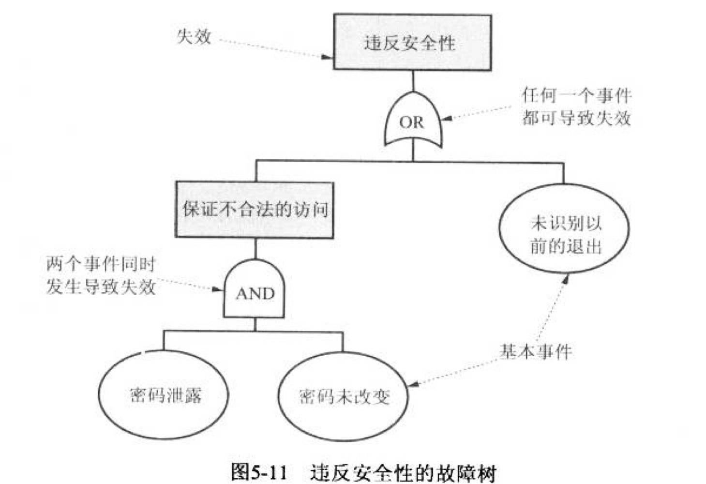
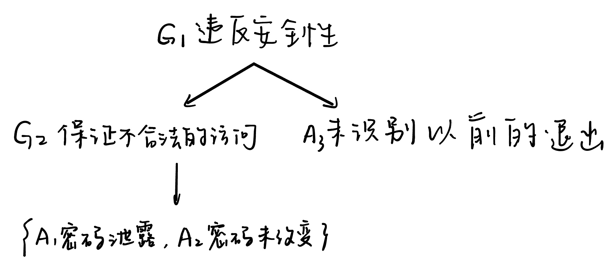
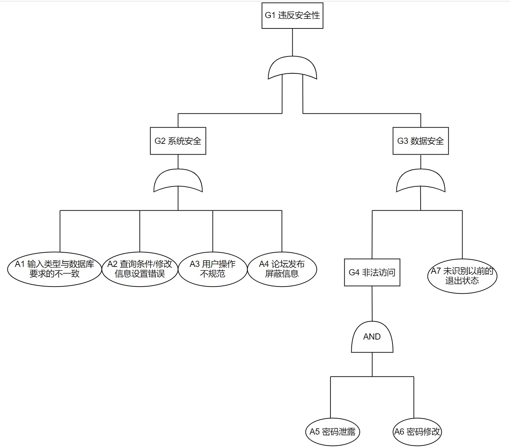
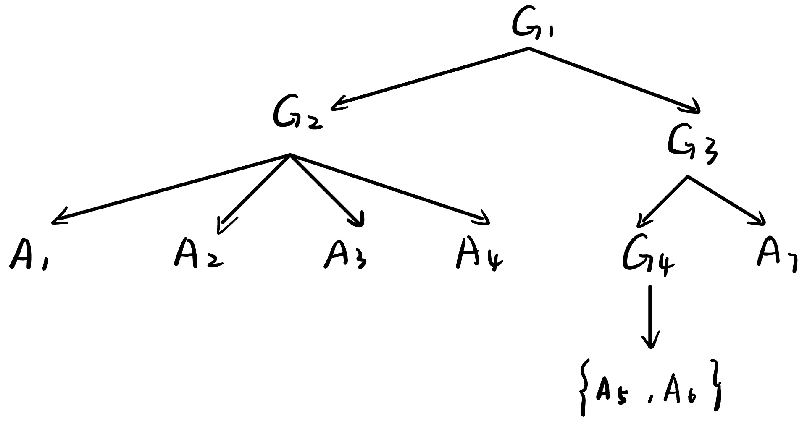
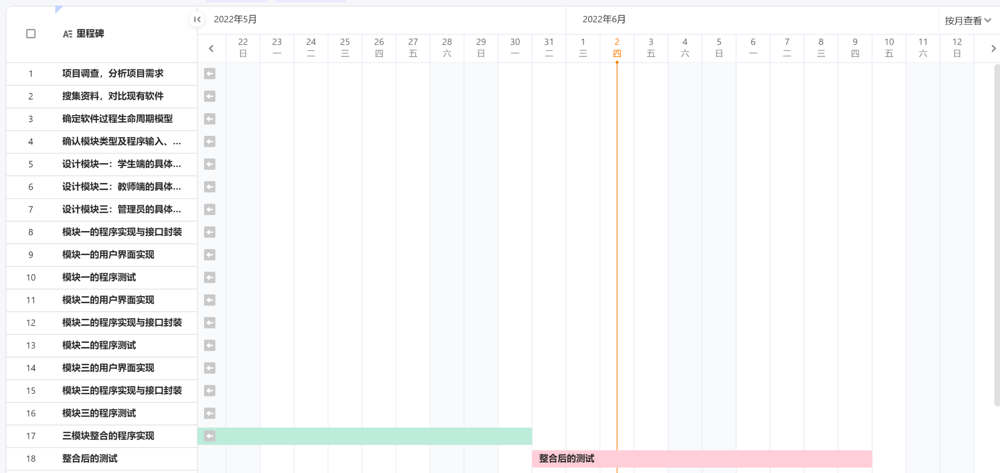

# 实验十一 软件体系结构设计（三），设计模块（一）

### 实验目的

1. 练习故障树分析
2. 培养设计原则实践的能力
3. 学习依赖注入 (dependency injection)
4. 学习设计模式，能在项目设计中运用设计模式进行面向对象设计

### 实验内容

#### 1. 第五章课后习题14，故障树转割集树练习。针对自己项目分析、描绘故障树，分解为割集树 （附到最终提交的SAD）。

##### 课本ch5 习题14：故障树转割集树练习

故障树

割集树

##### 针对自己项目分析、描绘故障树，分解为割集树 （附到最终提交的SAD）

项目故障树

项目割集树

#### 2. 参考教材6.2，结合项目的进程和开发历程，从设计原则的几个方面，组员对负责设计的模块进行评估，思考存在的问题和解决方案。

##### 模块化

​ 模块化也称作关注点分离，是一种把系统中各不相关的部分进行分离的原则，以便各部分能够独立研究。为了确定一个设计是否很好地分离了关注点，使用以下两个概念度量模块的独立程度：

- **耦合度：** 包括紧密耦合（模块之间存在大量依赖关系）、松散耦合（模块之间相互连接比较弱）和非耦合（模块之间相互独立）。耦合分为很多类型，例如：内容耦合、公共耦合、控制耦合、标记耦合、数据耦合。在设计过程中，要尽量实现低耦合，因此，在划分模块时，要充分考虑各个模块之间的相互关系。

- **内聚度：** 是指模块内部各个元素（数据、功能、内部模块）的粘合程度。聚合包括巧合内聚、逻辑内聚、时态内聚、过程内聚、通信内聚、功能内聚、信息内聚，它们的内聚度是逐渐升高的。我们的目的是尽可能地使模块高内聚，这样各个模块之间能易于理解，减少更改。

​ 因此为了实现高内聚，可采用**面向对象**的设计，当对象和动作有着一个共同并且明确的目标值，将它们放到一个模块内。

##### 接口

​ 每个软件单元有一个边界将它和系统的其余部分分开，以及一个接口来和其它软件单元进行交互。接口是系统其余部分定义了该软件单元提供的服务，以及如何获取这些服务。一个对象的接口是该对象所有公共操作以及这些操作的签名的结合，指定了操作名称、参数和可能的返回值。

​ 接口是一种设计结构，它对其它开发人员封装和隐藏了软件单元的设计和实现细节。

​ 对于我们的项目，可能由于对接口的规格说明不到位而影响到实际工作的开展。因此接口的规格说明描述必须要准确详尽，要向其它开发人员传达正确应用某个软件单元的所有信息。除了单元的访问功能和它们的签名，还应该包括：

- **目标：** 为每个访问函数的功能性建立充分详细的文档，以帮助其他开发入员找出最符合他们需要的访问函数。
- **前置条件：** 列出所有假设，又称为前置条件（如，输入参数的值、全局资源的状态，或者存在哪些程序库及软件单元），以帮助其他开发人员了解在何种情况下该软件单元才能正确工作。
- **协议：** 协议的信息包括访问函数的调用顺序、两个构件交换信息的模式。比如，一个模块进行调用共享资源之前需要被授权允许。
- **后置条件：** 将可见的影响称为后置条件。 我们为每个访问函数的后置条件编写文档，包括返回值、引发的异常以及公共变量（如输出文件）的变化，这样，调用它的代码才能对函数的输出作出适当的反映。
- **质量属性：** 质量属性（性能、可靠性）是对开发人员和用户可见的。

​ 此外，结构可能导致一些耦合的发生，为了实现低耦合，要尽量将**接口设计的简单**。

##### 信息隐藏

​ 信息隐藏的目标是是的软件系统更加易于维护。信息隐藏是将单元的设计决策隐藏，每个软件单元都封装了一个将来可以改变的独立的设计决策，然后我们根据外部可见的性质，在接口和接口规格说明的帮助下描述各个软件单元。信息隐藏的一个很大好处是使得软件单元具有低耦合度。

​ **实现信息隐藏的方法：** 在面向对象设计中，可将一个系统分解成对象和它们的抽象类型，换言之，每个对象（模块）都是抽象数据类型的示例。从这个角度上讲，每个对象对其他对象隐藏了它的数据表示，其他对象访问给定的一个对象的唯一途径是通过这个对象接口中声明的访问函数。

##### 增量式开发

增量式开发是软件工程当中，一种常用的软件开发过程思想。其中增量是指在软件开发过程中，先开发主要功能模块，再开发次要功能模块，逐步完善，最终开发出符合需求的软件产品。实际上，我们在初期的设计中，已考虑增量式开发，分别分为三个模块：**信息录入和修改模块 、查询信息模块、学生论坛模块**。

**存在问题：** 开发过程主次区分不强，没有考虑好互相之间的依赖关系。但如果依赖关系造成的循环太大会使得难以支持递增开发，除非循环的所有单元都已开发，否则没有一个单元可以被开发出来。

**解决办法：**

- **夹层法：** 将循环中的一个单元分解成两个单元，这样分解后的新单元中一个没有必须依赖的单元，另一个也没有。可以反复使用夹层发，解除较长的循环链。
- **依赖倒置：** 用面向对象技术将两个单元之间的依赖关系颠倒，接触循环。两种解决方法使用后都应形成树形结构，每棵子树都是系统的一部分，可以一次一个软件单元地增量开发系统，依次实现该项目的三个模块。

##### 抽象

​ 抽象是一种忽略细节来关注其他细节的模型或表示。在我们的项目开发中，我们将功能模块化，对各个细化功能用类和函数封装使用，起到了抽象的效果。

**存在问题：** 对各个类和函数统一、标准化的管理，没有形成规范的结构。

**解决办法：** 建立抽象图，将系统分解为各个子系统，每个子系统再被分解成更小的子系统，一直分解下去。其中分解的顶层给我们提供问题系统层次上的纵览，同时隐藏一些细节，如此，可以帮助我们集中关注需要研究和理解的设计功能和特性。对于分解方法，我们可以用一种视图展示不同运行进程以及它们的内部的联系，但考虑到我们项目体量小不需要多线程机制，因此不过多考虑，另一种视图展示分解成代码单元的系统 。

##### 通用性

​ 在开发软件单元时，使它尽可能地能够成为通用的软件，来加强它在将来某个系统中能够被使用的可能性。我们的校园助手主要以网页的形式为主，通用性暂时不在考虑范围内，在各类操作系统上都能运行。

#### 3. 阅读下面DI资料（或查阅其它相关资料），学习依赖注入技术

> Dependency injection - Wikipedia
> 
> Dependency Injection-A Practical Introduction.pdf

传送门：[依赖注入技术](lab11/依赖注入技术.md)

#### 4. 阅读下面设计模式资料（或查阅其它相关资料），结合项目的进程和开发历程，分析项目采用了那些设计模式

> Design Patterns-Elements of Reusable Object-Oriented Software.pdf
> 
> The GoF Design Patterns Reference.pdf
> 
> Design Patterns - Wikipedia

设计模式（Design pattern）是一套被反复使用、多数人知晓的、经过分类编目的、代码设计经验的总结。

提倡设计模式的根本原因是为了代码复用，增加可维护性 。
设计模式有助于对框架结构的理解，成熟的框架通常使用了多种设计模式。

Design Patterns: Elements of Reusable Object-Oriented Software.pdf中，设计模式从应用的角度被分为三个大的类型：创建型模式、结构型模式、行为型模式

- 创建型模式
  用来创建对象的模式，抽象了实例化过程
  
  - 单例模式 (Singleton)：保证一个类有且仅有一个实例，提供一个全局访问点
  - 工厂方法 (Factory Method)：父类负责定义创建对象的公共接口，而子类则负责生成具体对象，将类的实例化操作延迟到子类中完成
  - 抽象工厂(Abstract Factory)：为一个产品族提供统一的创建接口。当需要这个产品族的某一系列的时候，可以从抽象工厂中选出相应的系列创建一个具体的工厂类
  - 建造者模式 (Builder)：将复杂对象的构建与它的表示分离，同样的构建过程可以创建不同的表示。允许用户可以只通过指定复杂对象的类型和内容就可以构建它们，用户不知道内部的具体构建细节
  - 原型模式 (Prototype)：通过“复制”一个已经存在的实例来返回新的实例,而不是新建实例。被复制的实例就是我们所称的“原型”，这个原型是可定制的。原型模式多用于创建复杂的或者耗时的实例，因为这种情况下，复制一个已经存在的实例使程序运行更高效；或者创建值相等，只是命名不一样的同类数据

- 结构型模式
  结构型模式讨论的是类和对象的结构，它采用继承机制来组合接口或实现（类结构型模式），或者通过组合一些对象，从而实现新的功能（对象结构型模式）
  
  - 合成（Composite）模式：定义一个接口，使之可以用于单一对象，也可以应用于多个单一对象组成的对象组
  - 装饰（Decorator）模式：动态给一个对象添加一些额外的职责，就好像给一个物体加上装饰物，完善其功能
  - 代理（Proxy）模式：在软件系统中，有些对象有时候由于跨越网络或者其他的障碍，而不能够或者不想直接访问另一个对象，如果直接访问会给系统带来不必要的复杂性，这时候可以在客户程序和目标对象之间增加一层中间层，让代理对象来代替目标对象打点一切，这就是代理（Proxy）模式
  - 享元（Flyweight）模式：Flyweight是一个共享对象，它可以同时在不同上下文（Context）使用
  - 外观（Facade）模式：外观模式为子系统提供了一个更高层次、更简单的接口，从而降低了子系统的复杂度和依赖。这使得子系统更易于使用和管理。外观承担与子系统中类交互的责任
  - 桥梁（Bridge）模式：桥梁模式的用意是将问题的抽象和实现分离开来实现，通过用聚合代替继承来解决子类爆炸性增长的问题
  - 适配器(Adapter)模式：将一个类的接口适配成用户所期待的接口。一个适配器允许通常因为接口不兼容而不能在一起工作的类工作在一起，做法是将类自己的接口包装在一个已存在的类中

- 行为型设计模式
   着力解决的是类实体之间的通讯关系，希望以面向对象的方式描述一个控制流程
  
  - 模版方法（Template Method）：定义了一个算法步骤，并允许子类别为一个或多个步骤提供其实现方式。让子类别在不改变算法架构的情况下，重新定义算法中某些步骤
  - 观察者（Observer）模式：定义了对象之间一对多的依赖，当这个对象的状态发生改变的时候，多个对象会接受到通知，有机会做出反馈
  - 迭代子（Iterator）模式：提供一种方法顺序访问一个聚合对象中各个元素, 而又不需暴露该对象的内部表示
  - 责任链（Chain of Responsibility）模式：很多对象由每一个对象对其下一个对象的引用而连接起来形成一条链。请求在这个链上传递，直到链上的某一个对象决定处理此请求。发出这个请求的客户端并不知道链上的哪一个对象最终处理这个请求，这使系统可以在不影响客户端的情况下动态的重新组织链和分配责任
  - 备忘录（Memento）模式：在不破坏封装性的前提下，捕获一个对象的内部状态，并在该对象之外保存这个状态。这样以后就可将该对象恢复到原先保存的状态
  - 命令（Command）模式：将请求及其参数封装成一个对象，可以对这些请求排队或记录请求日志，以及支持可撤销操作
  - 状态（State）模式：允许一个“对象”在其内部状态改变的时候改变其行为，即不同的状态，不同的行为
  - 访问者（Visitor）模式：表示一个作用于某对象结构中的各元素的操作。它使你可以在不改变各元素的类的前提下定义作用于这些元素的新操作
  - 解释器(Interpreter) 模式：给定一个语言，定义它的文法的一种表示，并定义一个解释器，这个解释器使用该表示来解释语言中的句子
  - 中介者（Mediator）模式：用一个中介对象来封装一系列的对象交互
  - 策略（Strategy）模式：定义一组算法，将每个算法都封装起来，并且使它们之间可以互换。策略模式使这些算法在客户端调用它们的时候能够互不影响地变化

**我们的项目中采用了以下设计模式：**

- 单例模式
  
  - 单例设计模式的特点：
    1.单例设计模式保证一个类只有一个实例;
    2.要提供一个访问该类对象实例的全局访问点。
  
  单例模式最重要的就是要保证一个类只有一个实例并且这个类易于被访问。
  一个全局类使得一个对象可以被访问，但是这样做却不能防止你实例化多个对象。
  
  - 单例设计模式的实现：
    1.为了避免其它程序过多的建立该类的对象，先禁止其它程序建立该类对象实例（将构造器私有化）。
    2.为了方便其它程序访问该类的对象，只好在本类中自定义一个对象，由1可知该对象是static的，并对外提供访问方式。

- 观察者模式
  定义对象间的一种一对多依赖关系，使得每当一个对象状态发生改变时，其相关依赖对象皆得到通知并被自动更新。观察者模式又叫做发布-订阅（Publish/Subscribe）模式、模型-视图（Model/View）模式、源-监听器（Source/Listener）模式或从属者（Dependents）模式。
  
  - 模式动机
    建立一种对象与对象之间的依赖关系，一个对象发生改变时将自动通知其他对象，其他对象将相应做出反应。在此，发生改变的对象称为观察目标，而被通知的对象称为观察者，一个观察目标可以对应多个观察者，而且这些观察者之间没有相互联系，可以根据需要增加和删除观察者，使得系统更易于扩展，这就是观察者模式的模式动机。
  - 观察者模式分析
    观察者模式描述了如何建立对象与对象之间的依赖关系，如何构造满足这种需求的系统。
    这一模式中的关键对象是观察目标和观察者，一个目标可以有任意数目的与之相依赖的观察者，一旦目标的状态发生改变，所有的观察者都将得到通知。
    作为对这个通知的响应，每个观察者都将即时更新自己的状态，以与目标状态同步，这种交互也称为发布-订阅(publish-subscribe)。目标是通知的发布者，它发出通知时并不需要知道谁是它的观察者，可以有任意数目的观察者订阅它并接收通知。
  - 项目分析
    当学生退选某项课程后，会导致该课程的课余量增加，
    某些同学对“奖惩管理”的奖惩情况的变化非常关心，很想跟踪“奖惩管理”中个人奖惩信息的变化。学生可以通过设置让“奖惩管理”模块及时通知该同学最新的奖惩变化情况。
  - 观察者模式的优点
    具体目标和具体观察者是松耦合关系。由于目标接口仅仅依赖于观察者接口，因此具体目标只是知道它的观察者是实现观察者接口的某个类的实例，但不需要知道具体是哪个类。同样，由于观察者仅仅依赖于目标接口，因此具体观察者只是知道它依赖的目标是实现目标接口的某个类的实例，但不需要知道具体是哪个类。
    观察模式满足“开-闭原则”。目标接口仅仅依赖于观察者接口，这样，我们就可以让创建具体目标的类也仅仅是依赖于观察者接口，因此如果增加新的实现观察者接口的类，不必修改创建具体目标的类的代码。同样，创建具体观察者的类仅仅依赖于目标接口，如果增加新的实现目标接口的类，也不必修改创建具体观察者类的代码。
  - 观察者模式的缺点
    如果一个观察目标对象有很多直接和间接的观察者的话，将所有的观察者都通知到会花费很多时间。
    如果在观察者和观察目标之间有循环依赖的话，观察目标会触发它们之间进行循环调用，可能导致系统崩溃。
    观察者模式没有相应的机制让观察者知道所观察的目标对象是怎么发生变化的，而仅仅只是知道观察目标发生了变化。

#### 5. 给出4种设计模式的例子（语言不限，以组为单位），并总结其特点 （保存到每个小组选定的协作开发平台上）

[设计模式](lab11/设计模式.md)

### 本周进度

##### 个人进度

- [x] 马一凌 给出4种设计模式的例子，并总结其特点
- [x] 何欣越 从设计原则的几个方面，对负责设计的模块进行评估
- [x] 陈淑媛 阅读DI资料，学习依赖注入技术
- [x] 邱情珍 故障树转割集树练习+针对自己项目分析、描绘故障树，分解为割集树
- [x] 曾祥薇 阅读设计模式资料，结合项目的进程和开发历程，分析项目采用了那些设计模式

##### 团队进度

- [x] 故障树转割集树练习+针对自己项目分析、描绘故障树，分解为割集树
- [x] 从设计原则的几个方面，对负责设计的模块进行评估
- [x] 阅读DI资料，学习依赖注入技术
- [x] 阅读设计模式资料，结合项目的进程和开发历程，分析项目采用了那些设计模式
- [x] 给出4种设计模式的例子，并总结其特点
