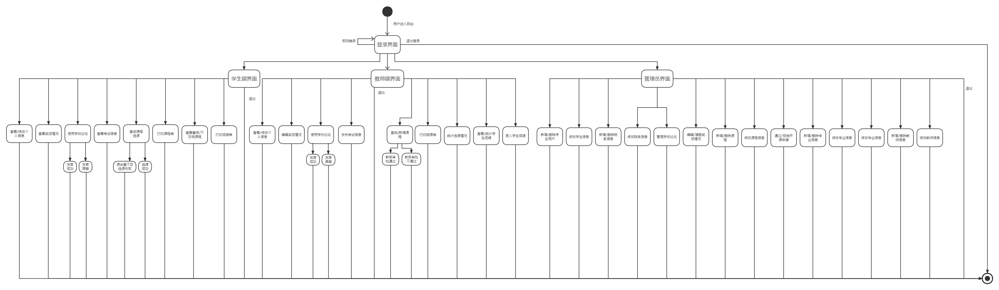
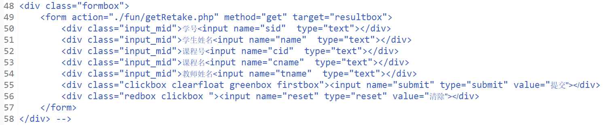
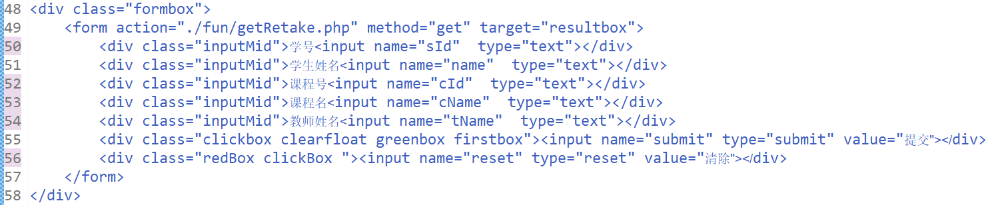
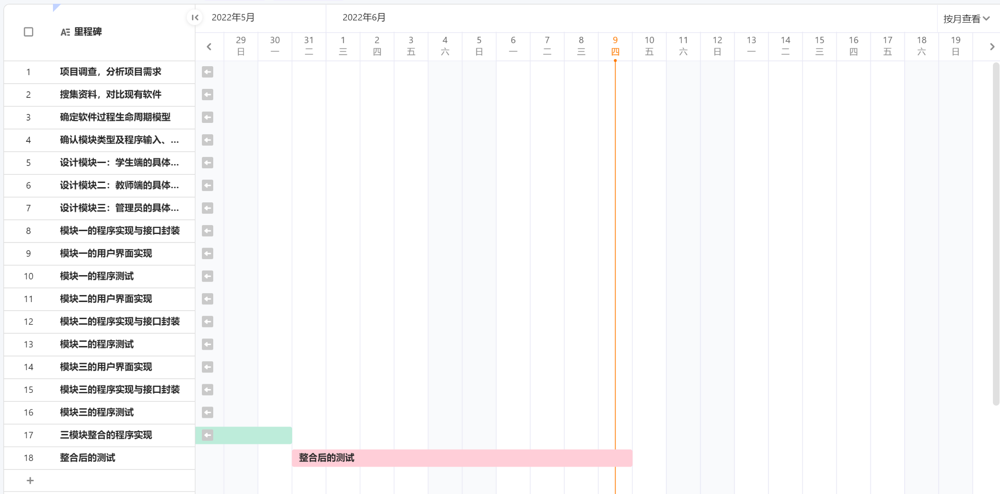

# 实验十二  设计模块（二），编写程序，软件测试（一）

### 实验目的

1. 培养利用UML工具的能力

2. 面向对象设计原则

3. 编程指导原则：讨论程序编写方式与规则

4. 了解软件测试

### 实验内容

#### 1. 通过实例，熟悉各种UML图的使用。

> 参考教材P226，补充材料6-4 皇家服务站的例子，学习分析其各种UML图的设计过程。
> 参照上面的例子，回顾自己的项目曾设计过的UML图，分工协作，修改。

##### （1）参考教材P226，补充材料6-4 皇家服务站的例子，学习分析其各种UML图的设计过程。

UML图包括了系统的动态视图、静态视图、约束和形式化。动态视图可以使用用例图、活动列表、表示顺序和通信的交互图以及表明状态及其变化的状态机来描述。静态视图可以使用类图来描述，用来表示关系（关联、泛化、依赖和实现）和可扩展性（约束、标记值和构造性）。另外静态视图还展示了包图和部图。约束和形式化可以用对象约束语言（ObjectConstraintLanguageOCL）来表示。

1. 过程中的UML
   
   在需求分析过程中，用例图（usecasediagram）通过描述系统必须执行的一般过程对系统进行描述。另外，用例还可以体现描述系统如何工作、用户如何与系统交互的场景。UML活动图（UMLactivitydiagram）是对这些图的补充，它是一种描述了业务活动的工作流过程模型；领域模型（domainmodel）也是一种补充，它从实体的角度定义了系统的领域。
   
   如果要构建一个大型的系统，那么软件体系结构可以用UML构件图（componentdiagram）和UML部图（deploymentdiagram）米建模。UML构件图说明了运行时的构件以及它们之间的交互；UML部署图说明了如何为构件分配计算资源。
   
   **模块设计流程：**
   
   - 模块设计首先从设计UML类图（classdiagram）开始。首先根据与用户起勾画出的场景，非正式地定义类以及它们间的关系：然后随着设计的进展进-步地对它们进行细化。系列的结构以及对象图将描述类之间的关联关系，包括继承关系。
   
   - 接下来，将对系统的动态方面进行设计。一开始，用简单的交互图interactiondiagram）来说明类与类之间的交互方式：顺序图和通信图。
   
   - 随着理解的不断深入，我们为每个单独的对象分配职责。在这个阶段，我们可以使用活动图（activitydiagram）来描述复杂的操作。与活动图相呼应，我们用状态图（statediagram）来展现一个对象可能具有的所有可能的状态，以及在什么条件下对象会执行其操作。
   
   - 最后，我们将这些类打包，使得设计更加层次化、更便于理解。最终的模型是包图（packagediagram）。

2. UML类图
   
   我们的设计过程从陈述需求开始，提取名词，寻找能够为我们第一次确定类而提供建议的条目：
   
   ```
   （1）参与者；
   （2）物理对象；
   （3）位置；
   （4）组织；
   （5）记录；
   （6）事务；
   （7）事物的集合；
   （8）操作过程；
   （9）系统将会操级的事物。
   ```
   
   然后以下面的问题为指导，判断候选类中应该包括哪些类。
   
   ```
   （1）哪些数据需要以某种方式被“处理”
   （2）哪些条目有多个属性？
   （3）什么时候一个类所拥有的对象不止一个？
   （4）哪些信息是根据需求本身而得出的，而不是从对需求的理解中得到的？
   （5）哪些属性和操作对个类或对象总是适用的？
   ```
   
   然后检查其他需求，看还有什么需要添加到我们已有的属性和类的列表中，因此，我们又有了新的候选类。
   
   接下米，我们来确定哪些行为必须出现在我们的设计中。我们从需求中提取动词，寻找能使人想到特定行为的条目，这些行为将会成为一个类或对象所采取的动作或担负的职责，或者是对其他类或对象所施加的动作：
   
   ```
   祈使动词；
   被动词；
   动作；
   其中的成员关系；
   管理或拥有；
   对谁负责；
   一个组织提供的服务。
   ```
   
   最后，为了方便管理对象、类和行为，我们使用UML图来描述它们之间的关系。

3. 其他UML图
   
   （1）UML包图（packagediagram）使得我们可以将系统看成是由包组成的一个较小的集合，而每个包都可以展开为个由类组成的很大的集合。包图展示了不同包中的类之的依赖关系。
   
   （2）为了给动态行为建模，我们创建交互图（interactiondiagram）来描述对象如何实现操作和行为。我们往往为每一个用例图创建一个交互图，来说明该用例中那些典型的系统和外部的参与者的消息交换。交互图有两种：顺序图和通信图。
   
   - 顺序图（sequencediagram）展示了活动或行为发生的顺序。在顺序图中，对象用方框表示，位于一条垂直线的顶端，这条垂直线就是该对象的生命线（ifelie），生命线上的狭窄的方框表明了这段时内该对象正在执行计算，计算一般发生在接收了一条消息后。两条生命线之间的箭头表示两个对象之间的消息，它用消息名来标注，有时候还会有发送消息必须满足的条件。箭头上的星号表示消息会发送很多次，分别传送给不同的对象。如果消息的箭头经过循环回到了原来发送它的对象本身，则表明该对象给自己发送了消息。
   
   - 通信图（communicationdiagram）也描述了对象之间的消息顺序，但是它是基于对象模型之上的，使用对象之间的链接作为隐含的信道。它和顺序图一样用图标表示对象，用箭头表示消息。然而，和顺序图不同的是，通信图中消息的顺序用编码表示。
   
   - UML还支持另外两种交互图来为所有对象或操作的动态行为建模，即状态图和活动图。
   
   - 状态图（statediagram）展示了对象可能具备的状态、触发状态改变的事件，以及每次状态改变所导致的动作。通常情况下，对象的每个状态都和一个属性值集合相关，当有消息发送或接收时会有事件发生。因此，只有当对象随着属性值和消息的多种改变而有不同的动态行为时，类才需要状态图。
   
   - 活动图（activitydiagram）为类中的过程流或活动流建模。当根据条件决定调用哪个活动时，用决策节点来表示这种选择。图6-27给出了UML活动图中使用的表示法。和状态图一样，开始节点由一个黑点表示，结束节点由白色圆点和包含在其中的黑点表示，矩形框表示活动箭头则表示由一个活动变为另一个活动。

##### （2）参照上面的例子，回顾自己的项目曾设计过的UML图。

在本项目中，练习使用了动态建模工具——UML状态图以描述建模需求，与用户沟通。对其进行进一步完善与修改：

状态图的表示和第4章中介绍的状态转移图类似。开始节点由一个黑点表示，结束节点由白色圆点和包含在其中的黑点表示，矩形框表示状态，箭头表示由一个状态转移到另一个状态，转移的条件注明在箭头旁边。



#### 2. 论述利斯科夫替换原则（里氏代换原则）、单一职责原则、开闭原则、德（迪）米特法则、依赖倒转原则、合成复用原则，结合自己的实践项目举例说明如何应用 （保存到每个小组选定的协作开发平台上，以组为单位）

传送门：[六大设计原则及应用](/lab12/六大设计原则.md)

#### 3. 上网查询“阿里编程规范  （如：阿里巴巴JAVA开发手册）；华为"编程军规”等，对照自己的代码看有哪些不符合规范的地方，修改。

##### （1）阿里编程规范

[阿里巴巴Java开发手册终极版](lab12/阿里巴巴Java开发手册终极版v1.3.0.pdf)

##### （2）华为编程军规

- **军规一：**【避免在程序中使用魔鬼数字，必须用有意义的常量来标识。】

- **军规二：**【明确方法的功能，一个方法仅完成一个功能。】

- **军规三：**【方法参数不能超过5个】

- **军规四：**【方法调用尽量不要返回null，取而代之以抛出异常，或是返回特例对象（SPECIAL CASE object，SPECIAL CASE PATTERN）；对于以集合或数组类型作为返回值的方法，取而代之以空集合或0长度数组。】

- **军规五：**【在进行数据库操作或IO操作时，必须确保资源在使用完毕后得到释放，并且必须确保释放操作在finally中进行。】

- **军规六：**【异常捕获不要直接catch (Exception ex) ，应该把异常细分处理。】

- **军规七：**【对于if „ else if „(后续可能有多个else if …)这种类型的条件判断，最后必须包含一个else分支，避免出现分支遗漏造成错误；每个switch-case语句都必须保证有default，避免出现分支遗漏，造成错误。】

- **军规八：**【覆写对象的equals()方法时必须同时覆写hashCode()方法。】

- **军规九：**【禁止循环中创建新线程，尽量使用线程池。】

- **军规十：**【在进行精确计算时(例如:货币计算)避免使用float和double，浮点数计算都是不精确的，必须使用BigDecimal或将浮点数运算转换为整型运算。】

##### （3）代码修改

- 将方法名、参数名、成员变量、局部变量都统一使用lowerCamelCase风格，遵从驼峰形式
  
  
  
  修改为
  
  

#### 4. 阅读下面软件测试相关资料（或查阅其它相关资料），了解软件测试的基本概念、主要技术、重要挑战等

> Software Testing-A Research Travelogue (2000–2014).pdf

### 本周进度



##### 个人进度

- [x] 马一凌 根据“阿里编程规范”修改代码
- [x] 何欣越 论述六个原则，并举例说明如何应用
- [x] 陈淑媛 论述六个原则，并举例说明如何应用
- [x] 邱情珍 通过实例，熟悉各种UML图的使用
- [x] 曾祥薇 阅读软件测试相关资料，了解软件测试的基本概念、主要技术、重要挑战等

##### 团队进度

- [x] 通过实例，熟悉各种UML图的使用
- [x] 论述六个原则，并举例说明如何应用
- [x] 根据“阿里编程规范”修改代码
- [x] 阅读软件测试相关资料，了解软件测试的基本概念、主要技术、重要挑战等
