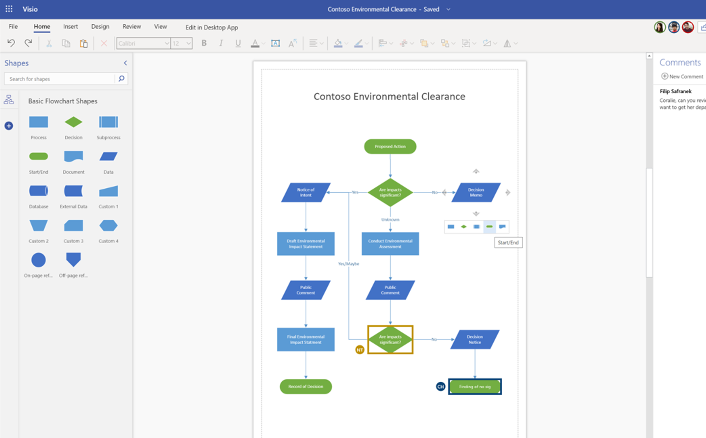
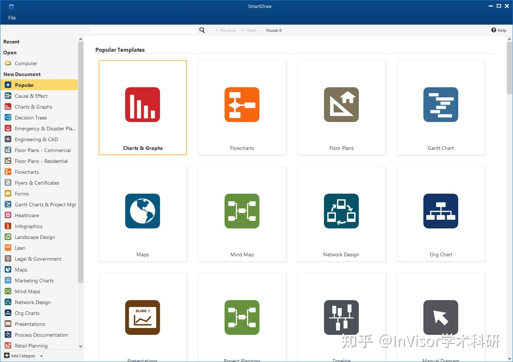
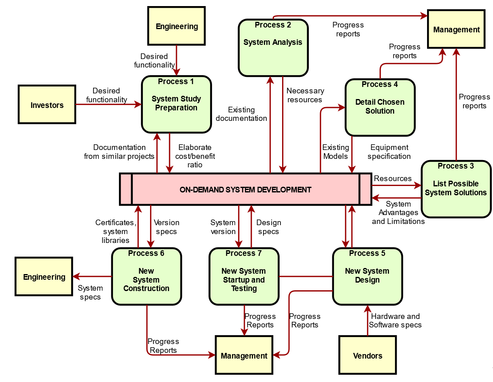
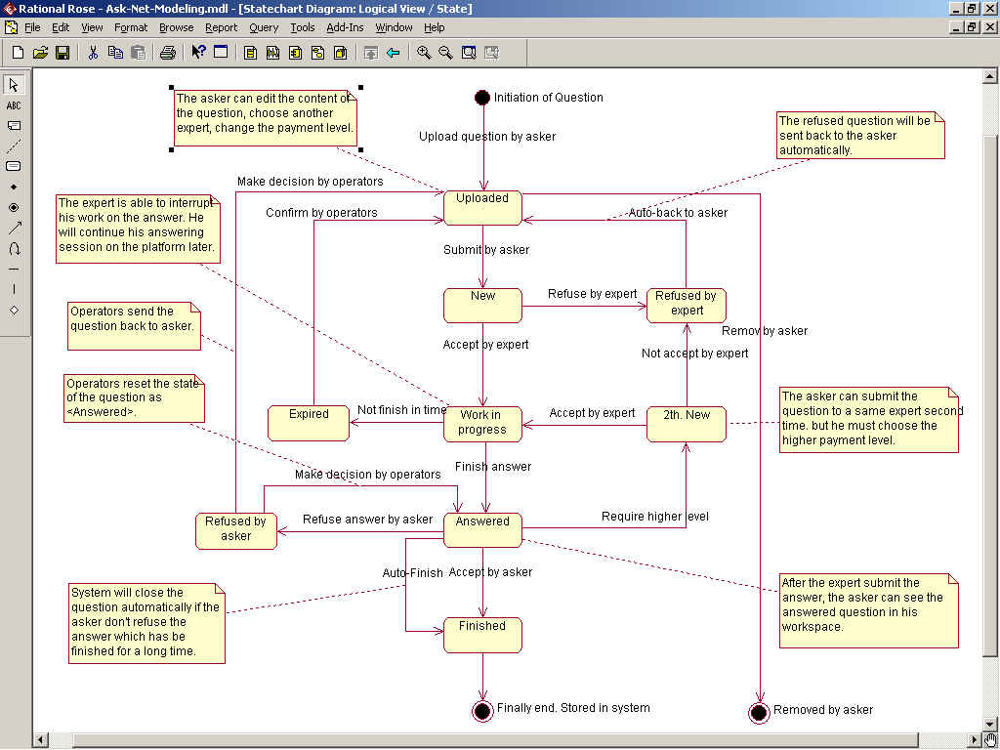
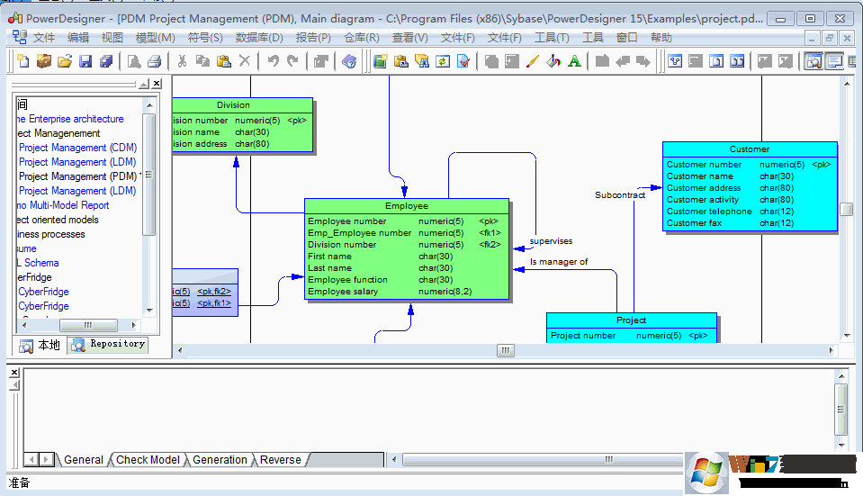
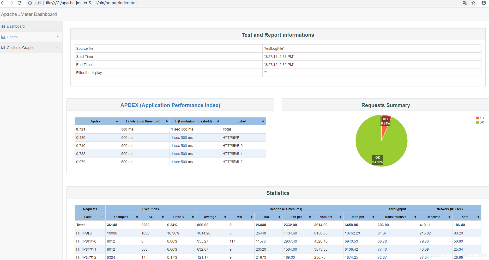
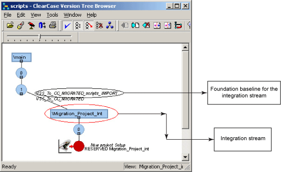

# 实验二 持续沟通修订可行性分析报告、CASE调研、软件生命周期模型

### 实验目的

1. 持续项目沟通、调查，修订可行性分析报告
2. 调研CASE软件工具，并学会使用
3. 研讨传统软件开发过程模型与敏捷开发

### 实验内容

#### 1. 按照分组继续进行项目沟通调查，对上周的可行性报告进行修订

传送门：[可行性分析报告](https://github.com/GOT-CA/document/blob/main/%E5%8F%AF%E8%A1%8C%E6%80%A7%E5%88%86%E6%9E%90%E6%8A%A5%E5%91%8A.docx)

#### 2. CASE（Computer-Aided Software Engineering，计算机辅助软件工程）工具调研及应用

我们一共调查了七款不同的 CASE 工具，以下为它们的简介、优点、缺点等。

**（1）MicrosoftVisio**

- **简介**：visio是目前国内用得最多的case工具。它提供了日常使用中的绝大多数框图的绘画功能（包括信息领域的各种原理图，设计图)，同时提供了部分信息领域的实物图。visio的精华在于其使用方便，安装后的visio2000既可以单独运行，也可以在word中作为对象插入，与word集成良好，其图生成后在没有安装visio的word仍然能够查看。Visio不仅在在处理框和文字上的流畅，同时在文件管理上提供了分页、分组的管理方式。visio支持UML的静态和动态建模，对UML的建模提供了单独的组织管理。

- **优点**：它是最通用的硬件、网络平台等图表设计软件。好处是易用性高，特别是对不善于自己构造图的人。

- **缺点**：
  ①画各类图形都有更好、更专业的替代工具
  ②VISIO的图只能以对象的方式插入用户的主文档，也只有在它本身环境下才能修改。
  
  

**（2）Smartdraw**

- **简介**：SmartDraw属于一个老牌绘图软件。使用它可以轻松创建数据流程图、程序流程图、网络结构图、地图、室内设计图等等。利用鼠标拖放相应的图形、线条即可以快速创建出漂亮而又专业的设计图。而且当移动图形时，相关的线条也会自动移动。对于程序设计、网络结构设计等领域的应用来说，SmartDraw算得上是一个短小精悍的工具。

- **优点**：
  ①简单易操作
  ②支持大量的图表模型
  
- **缺点**：
  ①用户界面不够友好
  ②绘图工作区的网格不能比较准确的确定各个图形的位置，连接点不唯一固定
  ③收费较高
  
  

**（3）Diagrams**

- **简介**：diagrams.net/draw.io 是一个用于构建图表应用程序的开源技术堆栈，也是世界上使用最广泛的基于浏览器的最终用户图表软件。

- **优点**：
  ①可以使用代码的方式绘制诸如阿里云、AWS、Azure、K8S 等系统架构原型图，相比于在 UI 上对各种图标进行拖拽和调整，这种方式更符合程序员的使用习惯；
  ②diagrams非常的轻量化，在功能上可以替代visio，适用于小团队的使用；
  ③免费开源；
  ④支持团队协作，图像导出方便；

  

**（4）RationalRose**

- **简介**：绘制的图形简洁美观，支持Java,J2EE,C++,MCF等语言和框架的建模。

- **优点**：
  ①支持对象模型、数据模型和数据存储模型的创建。
  ②映射逻辑和物理模型，从而灵活地将数据库设计演变为应用程序逻辑。
  ③支持数据模型、对象模型和已定义数据语言（DDL）文件／数据库管理系统（DBMS）之间的双向工程。
  ④变换同步选项（在变换期间对数据模型和对象模型进行同步）。
  ⑤数据模型-对象模型比较向导。
  ⑥支持一次性对整个数据库进行正向工程。
  ⑦集成了其他IBMRationalSoftwareDevelopment生命周期工具。
  ⑧能集成任何兼容SCC的版本控制系统，包括IBMRationalClearCase软件。
  ⑨能够以Web页面的方式发布模型和报告，以此来提高整个团队的沟通效率。

- **缺点**：Rose是第一代 UML工具，不再是主流软件，因此不推荐。

  

**（5）SybasePowerDesigner**

- **简介**：Powerdesigner是由Sybase公司开发的一套商业建模工具，它与ROSE、
  ERWin类似，主要是为数据库的建模设计的，但与它们相比，具有更加突出的功能。

- **优点**：
  ①PD可以方便地对管理信息系统进行分析设计，几乎包括了数据库模型模型设计的全过程。利用PD可以制作数据流程图、概念数据模型、物理数据模型，，可以生成多种客户端开发工具的应用程序，还可为数据仓库制作结构模型，也能对团队设计模型进行控制。它可与许多流行的数据库设计软件，例如：PowerBuilder，Delphi，VB等相配合使用来缩短开发时间和使系统设计更优化。②PD同时还提供完整的UML建模支持，以及面向对象设计和代码的生成工具，可以满足复杂的技术环境需求。所以可以说PD在数据库设计建模方面是做的最好的了。
  ③很多公司现在在用三个不同的产品，一个是做需求分析，企业流程；另外一个是数据库设计；另外一个是UML数据设计，三个部分可能连不到一起。造成问题是比如需求改了，数据改了，对哪个类有关系，跟哪个流程有关系看不出来，最后还得手工改。powerDesigner工具确可以把这些所有的建模工具连一起，需求改了，数据模型改了都没关系。另外PowerDesigner对新的技术支持的也比较好。它支持了所有的最新的数据库，不光支持Sybase本身的数据库，也支持IBM、微软、ORACLE的数据库。

- **缺点**：用Powerdesigner进行比较大型的项目，是很好的，对于短平快类型的项目。如果时间要求1个星期完成一个程序，那么完全没有必要用PowerDesigner，直接维护数据库就可以了。

  

**（6）Apache JMeter**

- **简介**：JMeter是一个纯粹的Java编写的应用程序，它主要是用来进行负载和性能测试。原先它是为Web/HTTP测试而设计的。设计JMeter最初始的目的是用来测试WebApplication但是现在已经扩展了很多功能。JMeter通常被用来对一些静态的或者动态资源（比如PHP,Java，ASP.Net等编写的Web，或者是JavaObject，DataBasesandQueries,FTP服务器等等）进行性能测试。它通常模拟大量的数据对一个Server或者一个ServerGroup网络等进行负载测试。然后通过分析它产生的性能图表来判断测试结果。和其他性能压测工具相比较，还是比较轻量级的，不够好像不支持IP伪装。

- **优点**：
  ①开源免费，基于Java编写，可集成到其他系统可拓展各个功能插件
  ②支持接口测试，压力测试等多种功能，支持录制回放，入门简单
  ③相较于自己编写框架活其他开源工具，有较为完善的UI界面，便于接口调试
  ④多平台支持，可在Linux，Windows，Mac上运行
  ⑤轻量级，和其他测试工具相比更加灵活性

  

**（7）ClearCase**

- **简介**：Rational ClearCase是软件配置管理SCM工具的一种，它可以用来对代码或者其他软件开发资产进行版本控制。对于超过上百或者上千团队开发者的大型项目据说也有很好的支持。ClearCase提供了VOB的概念来进行配置管理，功能极其强大。ClearCase实现版本管理的基础是VOB，成员要更改受控资料，需要先设置一个自己的View,这个View是你感兴趣的受控资料范围，然后可以CheckOut资料到本地资料区，进行修改后再CheckIn提交。ClearCase目前支持的执行平台有UNIX/LINUX，WINNT。
- **优点**：
  ①ClearCase采用许多新的配置管理思想，相对于传统的CVS,VSS,PVCS等版本管理工具，ClearCase的功能更为完整。
  ②ClearCase极为有力的支持多版本、并行开发。
  ③ClearCase不仅可以提供基于文件的版本历史，甚至可以对整个目录系统的演化进行跟踪记录。
- **缺点**：ClearCase十分昂贵，普通企业难以购买，另外由于其功能十分强大，对系统管理员和使用者要求较高，培训费用不匪。

**最后我们团队选择轻量化的diagrams作为case工具。**

#### 3. 小组分工讨论传统软件开发模型与敏捷开发（中几种主要方法）的比较，分析各自的优缺点，以及如何应用于自己的项目中？并且分析自己项目中可能存在的风险，细化风险管理（做出风险分级及应对预案）。

**（1）常见的敏捷软件开发方法的特点**

​	I. 敏捷开发的过程有着更强的适应性而不是预设性，从敏捷宣言的第四条响应变化高于预设计划便可以看出来。因为软件开发过程的本身的不可预见性，很多用户在项目开始时不可能对于这个项目有着一个完整而明确的预期。很多对软件的预期都在后期的修改和完善过程中产生。因此高适应性显然更加符合软件工程开发的实际。而敏捷开发实现其适应性的方式主要在于，第一，缩短把项目提交给用户的周期；第二，增加用户，业务人员，开发人员这三者之间的交流；第三，通过减少重构的成本以增加软件的适应性。

​	II. 敏捷开发的过程中，更加的注重人的因素。在传统软件工程中，个人的因素很少的被考虑到分工中，每个个体都是只是整个代码开发机器的一个小小的螺丝钉，个人的意志和创造力很大程度上的被抹去为了更好的为集体服务。而在敏捷开发过程中，每个个人的潜力被充分的考虑，应用什么技术很大程度上直接由在第一线开发的技术人员决定；每个人的特点和创造力都可以充分地发挥，这样开发出来的软件更加的具有生命力，因为他融入了开发者的心血和创意，开发者不再是进行机械的乏味的堆砌，而是创造属于自己的艺术品，这样的条件下产生的代码必然在质量上更占优势。

​	III. 在敏捷开发的过程中，整个项目是测试驱动的而不是文档驱动的。不仅每个模块有着自己的相应的测试单元，开发人员在开发自己的模块的过程中必须保证自己所开发的模块可以通过这一单元的测试，并且集成测试贯穿了整个开发过程的始终。集成测试每天会进行十几次甚至几十次，而不是像传统方法一样只有当各个模块的编码都结束了之后再进行联合调试。这样，在软件开发的进程中每一点改动所引起的问题都容嘉容易暴露出来，使得更加容易在错误刚刚产生的时候发现问题从而解决问题。这样就避免了在最后整个系统完成时错误隐藏的太深给调试造成极大的困难。

**（2）传统软件开发过程与敏捷开发的比较**

​		I. 相对于瀑布开发模型

​		敏捷开发区别于瀑布式的特征很明显，敏捷开发是以一种迭代的方式推进的，而瀑布模型是最典型的预见性的方法，严格遵循预见计划的步骤顺序进行，步骤成为衡量进度的方法。敏捷开发过程中，软件一直处于可使用状态，它将项目分成若干相互联系、可以独立运行的子程序，因此，每个阶段软件都是可见的。

​		II. 相对于迭代式开发

​		两者的相同之处在于都强调在较短的开发周期提交软件。不同之处在于敏捷开发的周期可能更短，并且更加强调队伍中的高度协作。需求时刻在变，人们对于需求的理解也时刻在变，项目环境也在不停的变化，因此开发方法必须要能反应这种现实，敏捷开发就是属于这种适应性的开发方法，而非预设性。

​		另外重视交互也是一个明显的区别，敏捷开发更适用于小团队，比如在一个办公室工作，这样更有利于团队成员之间的交互，它也强调用户要与开发团队在一起工作，这样便于及时交流沟通，同时，“人与交互”也被列为敏捷开发价值观之首，可见其重要性。

​		III. 相对于螺旋模型

​		和螺旋开发方法相比，敏捷方法强调适应性而非预见性。“螺旋模型”的核心就在于不需要在刚开始的时候就把所有事情都定义的清清楚楚，只需要定义最重要的功能并且实现它，然后听取客户的意见，之后再进入到下一个阶段。如此不轮回重复，直到得到一个满意的最终产品。螺旋开发很大程度上时一种风险驱动的方法体系，因为在每个阶段之前及经常发生的循环之前，都必须首先进行风险评估。而敏捷开发，针对软件开发过程中诸多的不可预见性，强调的是适应性，适应性的方法集中在快速适应现实的变化。当项目的需求发生了变化，团队应该迅速驶应，这个团队可能很难确切地描述未来将如何变化。

**（3）自己项目的过程建模及风险分析**

​		团队目前采取增量模型的开发方式，将软件看作是一系列的增量构建来设计、实现、集成和测试，每一个构建有多种相互作用的模块所形成的提供特定功能的代码片段构成，开发出一部分就向用户展示一部分，及早地发现问题。先开发一个原型模型的软件，完成模型的主要功能，展示给用户征求意见。能够缩短时间，开发者和用户能同时协作。

​		开发过程中可能会出现风险，由于是开发初期，项目还处于萌芽状态，可能会出现需求风险，软件项目在初期确定的需求往往都是模糊的、不确定的，而且随着项目的进展，需求还可能不断变化，这些问题如果没有得到及时的解决，就会对项目的成功造成巨大的潜在威胁。

​		风险管理用来处理项目中的各种不确定性。风险管理策略可以分为4个层次：

- 危机管理：风险已经造成麻烦后才着手处理。
- 风险缓解：事先制定好风险发生后的补救措施，但不制定任何防范措施。
- 着力预防：将风险防范作为项目的一部分加以规划和执行。
- 消灭根源：识别和消灭可能产生风险的根源。

​		对于项目要求采取主动的风险管理攻略，即着力预防和消灭根源的管理策略。这一策略在项目计划阶段就启动了：识别出潜在的风险、评估它们出现的概率和潜在的影响、按照重要性进行排序，然后制定一个计划来管理风险。

### 本周进度

##### 个人进度

- [x] 马一凌 可行性分析报告第4部分（所建议的系统） + 传统软件开发模型与敏捷开发的比较
- [x] 何欣越 可行性分析报告第1、2部分（引言 + 可行性研究的前提）
- [x] 陈淑媛 可行性分析报告第3部分（对现有系统的分析）
- [x] 邱情珍 可行性分析报告第7部分（社会因素方面的可行性） + CASE工具调研及应用
- [x] 曾祥薇 可行性分析报告第6部分（投资及效益分析）

##### 团队进度

- [x] 完善可行性分析报告
- [x] CASE工具调研（团队讨论），选择合适的工具
- [x] 研讨传统软件开发过程模型与敏捷开发
- [x] 项目风险分析