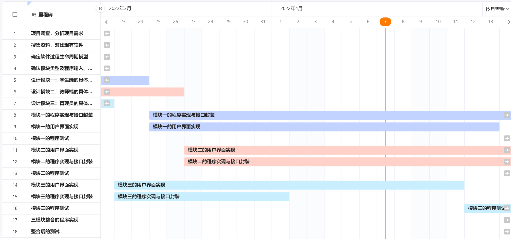

# 实验五 软件需求规格说明SRS（1）

### 实验目的

1. 学习软件需求规格说明SRS文档的要求和结构

2. 写作自己项目的SRS初稿

### 实验内容

#### 1. 学习国标中的文档11《软件需求规格说明SRS》，了解文档的要求和结构及与其他相关文档 （07,08,12,17等）的关系。

 已学习

#### 2. 搜集“软件需求规格说明SRS”编写案例

搜集完成

#### 3. 基于已积累的资料，写作自己项目的SRS草稿（大纲）。

草稿已完成，尚未整合

### 本周进度

##### 个人进度

- [x] 马一凌 需求说明3.5~3.7（CSCI外部接口+内部接口）
- [x] 何欣越 需求说明3.8~3.15（适应性、保密性、计算机资源需求+软件质量因素+约束+数据）
- [x] 陈淑媛 需求说明3.4（CSCI能力需求）
- [x] 邱情珍 需求说明3.1~3.3（所需的状态和方式+需求概述+需求规格）
- [x] 曾祥薇 需求说明4~6（合格性规定+需求可追踪性+尚未解决的问题）+排版工作

##### 团队进度

- [x] 学习国标中的文档11《软件需求规格说明SRS》
- [x] 搜集“软件需求规格说明SRS”编写案例
- [x] 基于已积累的资料，写作自己项目的SRS草稿（大纲）