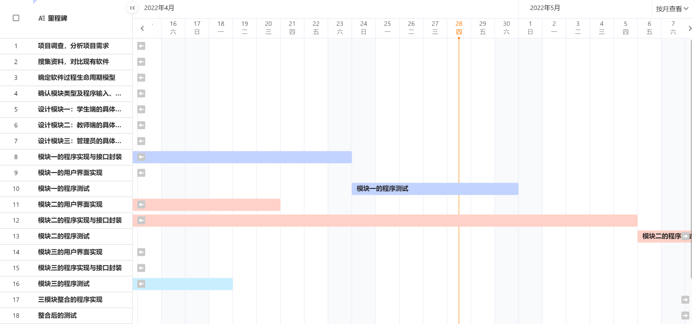

# 实验八 UML，逻辑

### 实验目的

1. 深入理解UML
   
2. 了解计算机学科中的逻辑
   
3. 完成自己项目的SRS

### 实验内容

#### 1. 阅读“The Unified Modeling Language Reference Manual”，进一步学习UML知识，理解如何应用UML对系统进行建模

##### (1) UML--Unified Modeling Language
language: 语言

modeling: 建模

unified: 统一的

##### (2) 模型
**简单理解**：是对现实的简化，是对系统从语义上近似的抽象
**模型的作用**：
- 精确捕获和表达项目的要求与应用领域中的知识，以使各方面利益相关者能够理解并达成一致
- 便于用户和各个领域的专家评审
- 降低复杂度
- 提高开发效率和质量
- 模型可以作为软件系统维护和升级时的文档

**建模方法** = 建模语言 + 建模过程

建模语言定义了用于表示设计的符号(通常是图形符号)

建模过程描述进行设计所需要遵循的步骤

**建模的四个原则**：
- 选择建立什么样的模型对如何发现和解决问题具有重要的影响。 
- 每个模型可以有多种表达方式。 
- 最好的模型总是能够切合实际。 
- 孤立的模型是不完整的。任何好的系统都是由一些几乎独立的模型拼凑出来的。

##### (3) 面向对象的基本观点
客观世界由对象组成。具有相同数据和相同操作的对象可以归并为一个类。从一个类可以派生出许多对象。

类可以派生出子类，子类和父类形成类的层次结构。

对象之间通过消息相互联系。面向对象=对象+类+继承+通信

一般/特殊（分类）结构：表现事务的一般与特殊的关系。术语称为泛化与特化的关系。

- 组装结构：表现对象类之间的部分与整体关系。

- 实例连接：表现对象间的静态联系。通过对象的属性来表现对象之间的关系。

- 消息连接：对象之间的通信联系。表现对象行为的动态联系。

##### (4) 面向对象分析的基本过程
- 发现对象：从对象中抽象出类的定义。
- 识别对象的内部特征：定义属性和服务
- 识别对象的外部关系：建立一般/特殊结构、整体/部分结构、实例连接、消息连接
- 划分主题，建立主题图 
- 定义用例，建立交互图：发现活动者、定义用例
- 建立详细说明：模型的详细定义与解释，分散在其它活动之中
- 原型开发：可反复进行

##### (5) 面向对象分析的层次
**对象模型通常由五个层次组成**：
- 类与对象层：对象是数据及其处理的抽象。它反映了保存有关信息和与现实世界交互的能力
- 属性层：属性是数据元素，用来描述对象或分类结构的实例，可在图中给出并在对象的储存中指定，即给出对象定义的同时，指定属性
- 服务层：服务是接收到消息后必须执行的一些处理，可在图上标明它并在对象的储存中指定，即给出对象定义的同时，定义服务。
五个层次就像合并在一起的五个透明的图层一样，每一层从不同角度将对象模型更细化、更具体化
- 结构层：结构表示问题域的复杂性。类 - 成员结构反映了一般 - 特殊关系，整体 - 部分结构反映了整体 - 部分的关系
- 主题层：主题给出分析模型的总体概貌，是控制读者在同一时间所能考虑的模型规模的机制

面向对象的模型的五个层次对应着分析建模的五个主要活动。这五个活动的工作可以不按顺序进行，也没必要完成一项活动后才开始另一项活动工作。也就是说，五个主要活动可以同时（并行）处理；可以从较高抽象层转移到较低的具体层，然后再返回到较高抽象层继续处理；当系统分析员在确定类-&-对象的同时，想到该类的服务，则可以先确定服务后，再返回去继续寻找类-&-对象；没有必要遵循自顶向下，逐步求精的原则。

##### (6) 面向对象分析的基本原则
- 抽象原则（类 对象 一般类 属性 服务）
- 分类原则（把具有相同属性和服务的对象化为一类）
- 聚合原则（将整体化为若干部分）
- 关联原则（用关联原则可以明确的表示对象之间的静态联系，实例连接）
- 消息通信原则（动态联系）

##### (7) 面向对象设计基本过程
- 设计对象与类
- 设计系统结构：一个软件由若干子系统组成，一个子系统由若干组件构成，设计系统结构的主要任务就是设计组件与子系统，以及它们相互的静态和动态关系。
- 系统结构两种形式：层次结构、块状结构
- 设计问题论域子系统：问题论域子系统负责实现领域的业务服务。应包括与应用领域的业务直接相关的全部类与对象。对OOA模型中的某些类、对象、结构、属性、操作进行调整
- 设计人机交互子系统：主要任务是设计系统界面。内容包括：用户分类、描述交互场景、设计人机交互操作命令、操作顺序，设计人机交互类如窗口、对话框、菜单等
- 设计数据管理子系统：数据管理子系统负责数据的管理：录入、操纵、检索、存储、输出等。设计数据管理子系统的主要任务是：确定数据管理方法，设计数据库逻辑结构和物理结构，设计实现数据管理的对象类
- 设计任务管理子系统：一个系统运行时将有相当数量的进程被激活执行。任务管理子系统的任务就是协调和管理进程。设计软件系统内部模块运行的管理机制，把事件驱动、时钟驱动、优先级管理等任务分配给软、硬件执行
- 设计优化，提高系统的性能：设计的结果要尽可能的优化，尽量提高系统的性能。各性能指标之间常存在矛盾，应权衡考虑选取一个折衷方案。 准则：弱耦合、强内聚、减少通信开销、良好的可扩充性

##### (8) 类的设计原则
- 类公共接口的单独成员应该是类的操作符。
- 类A的实例不应该直接发送消息给类B的成员。
- 操作符是公共的，当且仅当类实例的用户可用。
- 属于类的每个操作符要么访问、要么修改类的某个数据。
- 类必须尽可能少地依赖其他类。
- 两个类之间的互相作用应该是显式的。
- 继承结构的父类应该是目标概念的抽象模型。
##### (9) 基于UML的面向对象分析设计过程

- 发现对象，从对象中抽象出类的定义。
- 识别对象的内部特征，定义属性和服务。
- 识别对象的外部关系，建立一般/特殊结构、整体/部分结构、实例连接、消息连接。
- 划分主题，建立主题图。
- 定义用例，建立交互图。发现活动者、定义用例。
- 建立详细说明，模型的详细定义与解释，分散在其它活动之中。
- 原型开发，可反复进行

##### (10) 发现对象和定义类
**发现对象**

根本出发点：问题域和系统责任问题域侧重于从客观存在的事物发现系统中的对象，系统责任侧重于从系统范围内的每一项职责由哪些对象来完成发现对象，两者同时考虑，只考虑问题域导致不知道哪些事物以及他们的那些特征该舍弃，那些该提取，容易使某些功能实现不了；只考虑系统责任，使系统中的对象不能真实反映问题域。

例如：书和衣服若从问题域抽象得到的一定是完全不同的类，如果在系统中仅被作为销售商品时，那么他们就具有相同的属性和方法，此时，我们就可以将他们合并为一个类商品

**抽象出对象类**

几种常见问题：

从问题域抽象出的完全不同的若干类对象经系统责任为目标的抽象保留下来的属性和方法完全相同。解决方法：合并出现属性和服务相似的类。解决方法：建立一般/特殊结构或整体/部分结构出现对同一事物的重复描述。
##### (11) UML中的视图
**视图的分类**：

- 用例视图   系统使用实例
- 逻辑视图   系统逻辑结构
- 组件视图   系统构成
- 并发视图   系统并发特性
- 配置视图   系统的配置

这5种视图组合构成UML完整模型。

**下面详细分析这五种视图**：

- 用例视图
用途：描述系统应该具备的功能，即被称为参与者的外部用户所能观察到的功能。用例视图是几个视图的核心，它的内容直接驱动其他视图的开发。

- 逻辑视图
  用途：描述用例视图中提出的系统功能的实现。逻辑视图既描述系统的静态结构，也描述系统内部的动态协作关系。

  组成：静态结构在类图和对象图中进行描述；动态模型在状态图、时序图、协作图以及活动图中进行描述。

- 并发视图
  用途：考虑资源的有效利用、代码的并行执行以及系统环境中异步事件的处理。

  组成：状态图、协作图和活动图。

- 组件视图
用途：描述系统的实现模块以及它们之间的依赖关系

- 配置视图
用途：显示系统的物理部署，并描述位于节点实例上的运行组件实例的部署情况 。例如一个程序或对象在哪台计算机上执行，执行程序的各节点设备之间是如何连接的。

##### (12) UML中包含九种图
主要分为两类：静态图和动态图。
- 静态图
    UML中有5种静态图：用例图、类图、对象图、组件图和配置图。

- 动态图：

   UML中有4种动态图：时序图、协作图、状态图、活动图

##### (13) UML中的事物
UML中的事物包括结构事物、行为（动作）事物、组织（分组）事物、注释事物。

- 结构事物
结构事物包括7种：类、接口、协作、用例、活动类、组件和节点。

- 动作事物
动作事物主要有两种：交互和状态机。

- 分组事物
分组事物是UML模型中负责分组的部分，可以把它看作一个个盒子，每个盒子里面的对象关系相对复杂，而盒子与盒子之间的关系相对简单。成组事物只有一种：包（包是一种有组织地将一系列元素分组的机制）

- 注释事物
属于这一类的只有注释。注释即是UML模型的解释部分。在UML图中，一般表示为折起一角的矩形。

##### (14) UML通用机制
- 修饰：为图中的模型元素增加了语义。

- 注释：以自由的文本形式出现的。

  信息类型是不被UML解释的一个字符串。

- 规格说明
UML 中预定义的特性：
  - 文档（Documentation）
  - 职责（Responsibility）
  - 永久性（Persistence）
  - 并发性（Concurrency）

- 通用划分

  两种通用划分(General Division)：

  - 型-实例（值）：描述一个通用描述符与单个元素项之间的对应关系。
  - 接口-实现

- 扩展机制
  - 构造型
  
    由建模者设计的新的模型元素。新的模型元素的设计要以UML已定义的模型元素为基础。

  - 标记值

    附加到任何模型元素上的命名的信息块。

  - 约束

  用某种形式化语言或自然语言表达的语义关系的文字说明。

#### 2. 浏览“LOGIC IN COMPUTER SCIENCE--Modelling and Reasoning about Systems”，了解常用逻辑及其在计算机学科中的应用

Logic in Computer Science - Modelling and Reasoning about Systems（面向计算机科学的数理逻辑）

 

本书前两章涵盖命题逻辑和谓词逻辑，重点是自然演绎系统中的证明。自然演绎系统最困难的方面是引入和解除假设的方式，作者使用方框符号来界定假设的范围。自然演绎系统最适合学习者构建证明，虽然没有任何符号可以将假设的排放变成常规操作，但作者的选择对初学者来说很有意义。

 

第三章是本书从传统的方向出发，介绍了时序逻辑计算树逻辑 (CTL) 的模型检查，这是模型检查问题中，较易于处理的分支时间逻辑。模型检查问题是确定一个特定的结构——“可能世界”的有限结构或过渡系统——是否满足（“是一个模型”）CTL 的公式。出于多种原因，模型检查很有吸引力，它可以自动执行，可以有效地实现（见下文第六章的注释），当结构不能满足公式时，算法可以产生一个反例，以系统轨迹的形式不显示要求的行为。作者首先介绍了 CTL 并说明了它在实际规范问题中的用途，然后提出了一种简单的模型检查算法，并讨论了它在 SMV 系统中的实现。

 

第四章和第五章涵盖了用于命令式程序验证的 Hoare 逻辑和用于多智能体系统的模态逻辑。这两章都给出了应用程序的清晰视图，并包含全面的练习集。

 

第六章对二元决策图 (BDD) 进行了出色的阐述，这是一种布尔函数的新颖表示。给定函数变量的排序，简化的有序 BDD 给出布尔函数的规范表示，而更传统的表示形式，例如合取范式和析取范式，则不具备此属性。具有布尔函数的规范表示会产生许多优势：测试可满足性和有效性变成了检查与平凡的真或假 BDD 相等的问题，并且可以通过检查 BDD 的相等性来检查函数之间的相等性，更进一步可以只检查指针的相等性。作者展示了如何为任意函数构建 BDD 表示，然后将其扩展到模型、转换系统和状态集的表示。因此，朴素的模型检查算法可以用符号算法代替，在此基础上，可以有效地检查状态集为10100阶的模型。

 

本书主要介绍了命题逻辑、谓词逻辑、模型检测中的时态逻辑(包括线性时态逻辑LTL、计算树逻辑CTL、以及CTL*)、模型检测算法和不动点的证明、程序验证、模态逻辑、二叉树判定图等。本书还给出相关的模型检测工具NuSMV,介绍了Alloy语言，充分地向计算机科学实际应用方向延伸。

#### 3. 完成软件需求规格说明SRS

### 本周进度

##### 个人进度

- [x] 马一凌  深入理解UML
- [ ] 何欣越 
- [ ] 陈淑媛 
- [x] 邱情珍 了解计算机学科中的逻辑
- [ ] 曾祥薇 

##### 团队进度

- [x] 阅读“The Unified Modeling Language Reference Manual”，进一步学习UML知识，理解如何应用UML对系统进行建模
- [x] 浏览“LOGIC IN COMPUTER SCIENCE--Modelling and Reasoning about Systems”，了解常用逻辑及其在计算机学科中的应用
- [x] 完成软件需求规格说明SRS